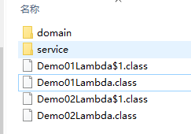
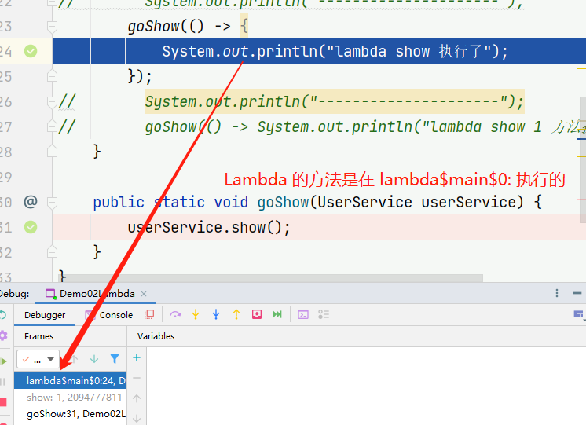
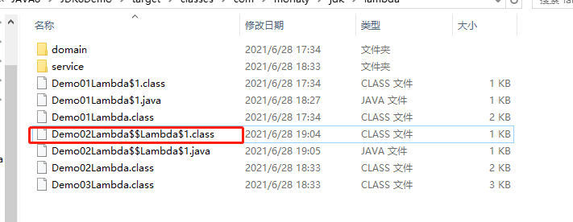
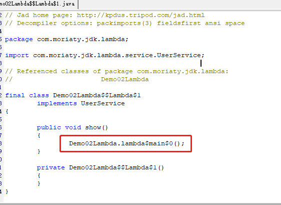

# 一、Lambda 表达式

## 1.1、需求分析 

​	创建一个新的线程，指定线程要执行的任务。

```java
public static void main(String[] args) {
        // 开启一个线程
        new Thread(new Runnable() {
            @Override
            public void run() {
                System.out.println("新线程中执行的代码：" + Thread.currentThread().getName());
            }
        }).start();
        System.out.println("主线程中的代码：" + Thread.currentThread().getName());
    }
```

代码分析：

1. Thread 类需要一个 Runnable  接口作为参数，其中抽象方法 run 方法是用来指定线程任务内容的核心。
2. 为了指定 run 方法体，不得不需要 Runnable 的实现类。
3. 为了省去定义一个 Runnable 的实现类，不得不使用匿名内部类。
4. 必须覆盖重写抽象的 run 方法，所有方法名称，方法参数，方法返回值不得不都重写一遍，而且不能出错。
5. 而实际上，我们只在乎方法体中的代码。

## 1.2、Lambda 的使用

​	Lambda 表达式是一个匿名函数，可以理解为一段可以传递的代码。

```java
new Thread(() -> {
            System.out.println("新线程 Lambda 表达式..." + Thread.currentThread().getName());
        }).start();
```

​	Lambda 表达式的优点：简化了匿名内部类的使用，语法更加简单。

​	匿名内部类语法冗余，体验了 Lambda 表达式后，发现 Lambda 表达式是简化匿名内部类的一种方式。

## 1.3、Lambda 的语法规则

​	Lambda 省去了面向对象的条条框框，Lambda 的标准格式由 3 个部分组成：

```java
(参数类型 参数名称) -> {
    代码体
}
```

## 1.4、Lambda 练习

### 1.4.1、练习1

​	练习无参无返回值的 Lambda

​	定义一个接口：

```java
public interface UserService {
    void show();
}
```

​	主方法调用：

```java
public class Demo02Lambda {

    public static void main(String[] args) {
        goShow(new UserService() {
            @Override
            public void show() {
                System.out.println("show 方法执行了");
            }
        });
        System.out.println("---------------------");
        goShow(() -> {
            System.out.println("lambda show 执行了");
        });
        System.out.println("---------------------");
        goShow(() -> System.out.println("lambda show 1 方法执行了"));
    }

    public static void goShow(UserService userService) {
        userService.show();
    }
}
```

​	输出：

```bash
show 方法执行了
---------------------
lambda show 执行了
---------------------
lambda show 1 方法执行了
```

### 1.4.2、练习2

​	练习有参有返回值的 Lambda 表达式

​	创建一个 Person 对象：

```java
@Data
@AllArgsConstructor
@NoArgsConstructor
public class Person {
    private String name;
    private Integer age;
    private Integer height;
}
```

​	然后我们在 List 集合中保存多个 Person 对象，然后对这些对象做 age 排序操作。

```java
 public static void main(String[] args) {
        List<Person> list = new ArrayList<>();
        list.add(new Person("周杰伦", 33, 175));
        list.add(new Person("刘德华", 43, 185));
        list.add(new Person("周星驰", 38, 177));
        list.add(new Person("郭富城", 23, 170));

               Collections.sort(list, new Comparator<Person>() {
            @Override
            public int compare(Person o1, Person o2) {
                return o1.getAge() - o2.getAge();
            }
        });

        for (Person person : list) {
            System.out.println(person);
        }
    }
```

​	我们发现在 sort 方法的第二次参数是一个 Comparator 接口的匿名内部类，且执行的方法有参数和返回值，那么我们可以改写为 Lambda 表达式。

```java
public static void main(String[] args) {
        List<Person> list = new ArrayList<>();
        list.add(new Person("周杰伦", 33, 175));
        list.add(new Person("刘德华", 43, 185));
        list.add(new Person("周星驰", 38, 177));
        list.add(new Person("郭富城", 23, 170));

        Collections.sort(list, (Person o1, Person o2) -> {
            return o1.getAge() - o2.getAge();
        });

        for (Person person : list) {
            System.out.println(person);
        }
    }
```

​	输出：

```bash
Person(name=郭富城, age=23, height=170)
Person(name=周杰伦, age=33, height=175)
Person(name=周星驰, age=38, height=177)
Person(name=刘德华, age=43, height=185)
```

## 1.5、@FunctionalInterface

```
@FunctionalInterface
被该注解修饰的接口只能声明一个抽象方法
```

## 1.6、Lambda 表达式的原理

​	匿名内部类的本质是在编译时生成一个 Class 文件，XXXX$1.class

```java
public class Demo01Lambda {
    public static void main(String[] args) {
        // 开启一个线程
        new Thread(new Runnable() {
            @Override
            public void run() {
                System.out.println("新线程中执行的代码：" + Thread.currentThread().getName());
            }
        }).start();
        System.out.println("主线程中的代码：" + Thread.currentThread().getName());

        System.out.println("-------------------------------------------------------");

        new Thread(() -> {
            System.out.println("新线程 Lambda 表达式..." + Thread.currentThread().getName());
        }).start();
    }
}
```




​	还可以通过反编译工具来查看生成的代码：Xjad 工具。

```java
static class Demo01Lambda$1
	implements Runnable
{

	public void run()
	{
		System.out.println((new StringBuilder()).append("新线程中执行的代码：").append(Thread.currentThread().getName()).toString());
	}

	Demo01Lambda$1()
	{
	}
}
```

​	那么 Lambda 表达式的原理是什么呢


写有 Lambda 表达式的 class 文件，通过 Xjad 查看报错，这是可以通过 JDK 自带的工具：javap 对字节码进行反汇编操作。

```shell
javap -c -p 文件名.class
-c：表示对代码进行反汇编
-p：显示所有的类和成员
```

​	反汇编的结果：

```java
Compiled from "Demo02Lambda.java"
public class com.moriaty.jdk.lambda.Demo02Lambda {
  public com.moriaty.jdk.lambda.Demo02Lambda();
    Code:
       0: aload_0
       1: invokespecial #1                  // Method java/lang/Object."<init>":()V
       4: return

  public static void main(java.lang.String[]);
    Code:
       0: invokedynamic #2,  0              // InvokeDynamic #0:show:()Lcom/moriaty/jdk/lambda/service/UserService;
       5: invokestatic  #3                  // Method goShow:(Lcom/moriaty/jdk/lambda/service/UserService;)V
       8: return

  public static void goShow(com.moriaty.jdk.lambda.service.UserService);
    Code:
       0: aload_0
       1: invokeinterface #4,  1            // InterfaceMethod com/moriaty/jdk/lambda/service/UserService.show:()V
       6: return

  private static void lambda$main$0();
    Code:
       0: getstatic     #5                  // Field java/lang/System.out:Ljava/io/PrintStream;
       3: ldc           #6                  // String lambda show ִ▒▒▒▒
       5: invokevirtual #7                  // Method java/io/PrintStream.println:(Ljava/lang/String;)V
       8: return
}

```

​	在这个反编译的源码中，我们看到了一个静态方法 lambda\$main$0()，我们可以通过 debug 查看他做了什么



上面的项目可以理解为如下：

```java
public class Demo02Lambda{
    public static void main(String[] args){
        ...
    }
    
    private static void lambda$main$0(){
        System.out.println("lambda show 执行了");
    }
}
```

​	为了更加直观的理解，我们可以在运行的时候添加 `-Djdk.internal.lambda.dumpProxyClasses`，加上这个参数会将内部 class 码输出到一个文件中。

```shell
-Djdk.internal.lambda.dumpProxyClasses
```

​	命令执行：

```shell
java -Djdk.internal.lambda.dumpProxyClasses com.moriaty.jdk.lambda.Demo02Lambda
lambda show 执行了
```

​	生成文件：



​	反编译后：



​	我们可以看到匿名的内部类实现了 UserService 接口，并重写了 show() 方法，在 show 方法中调用了 Demo02Lambda.lambda\$main$0，也就是调用了 Lambda 中的内容。

​	等价于：

```java
public class Demo02Lambda {

    public static void main(String[] args) {
        goShow(new UserService() {
            @Override
            public void show() {
                Demo02Lambda.lambda$main$0();
            }
        });
    }

    private static void lambda$main$0() {
        System.out.println("lambda show 执行了");
    }
}

```

小结：

匿名内部类在编译的时候会产生一个 class 文件。

Lambda 表达式在程序运行的时候会形成一个类。

1. 在类中新增了一个方法，这个方法的方法体就是 Lambda 表达式中的代码。
2. 还会形成一个匿名内部类，实现接口，重写抽象方法。
3. 在接口中重写方法会调用新生成的方法。

## 1.7、Lambda 的省略写法

​	在 Lambda 表达式的标准写法的基础上，可以使用省略写法的规则为：

1. 小括号内的参数类型可以省略
2. 如果小括号内有且仅有一个参数，则小括号可以省略
3. 如果大括号内有且仅有一个语句，可以同时省略大括号，return 关键字及语句分号。

```java
public class Demo04Lambda {

    public static void main(String[] args) {
        goStudent((String name, Integer age) -> {
            return name + age + " 666666";
        });

        // 省略写法
        goStudent((name, age) -> name + age + " 666666");

        goOrder((String name) -> {
            System.out.println(name);
            return 22;
        });

        // 省略写法
        goOrder(name -> 222);
    }

    public static void goStudent(StudentService studentService) {
        studentService.show("张三", 22);
    }

    public static void goOrder(OrderService orderService) {
        orderService.show("李四");
    }
}
```

## 1.8、Lambda 的使用前提

​	Lambda 表达式的语法是非常简洁的，但是 Lambda 表达式不是随便使用的，使用时有几个条件要特别注意。

1. 方法的参数或局部变量类型必须为接口，才能使用
2. 接口中有且仅有一个抽象方法 @FunctionalInterface

## 1.9、Lambda 和匿名内部类的区别

​	Lambda 和匿名内部类的对比：

1. 所需的类型不一样
   1. 匿名内部类的类型可以是类，抽象类，接口
   2. Lambda 表达式需要的类型必须是接口
2. 抽象方法的数量不一样
   1. 匿名内部类所需的接口中的抽象方法所需的数量是随意的
   2. Lambda 表达式所需的接口中只能有一个抽象方法
3. **实现原理不一样**
   1. **匿名内部类是在编译后形成一个 class**
   2. **Lambda 表达式是在程序运行的时候动态生成 class**

# 二、接口中新增的方法

## 2.1、JDK8 中接口的新增

​	在 JDK8 中针对接口有增强，在 JDK8 之前

```java
interface 接口名 {
    静态常量;
    抽象方法;
}
```

​	JDK8 之后对接口进行了增强，接口中可以有默认方法和静态方法。

```java
interface 接口名 {
    静态常量;
    抽象方法;
    默认方法;
    静态方法;
}
```

## 2.2、默认方法

### 2.2.1、为什么要增加默认方法

​	在 JDK8 之前接口中只能有抽象方法和静态常量，会存在以下问题：
​	如果接口中新增抽象方法，那么实现类都必须要重写这个抽象方法，非常不利于接口扩展。

### 2.2.2、接口默认方法的使用方式

​	接口中默认方法的语法是：

```java
interface 接口名 {
    default 返回值类型 方法名(参数) {
        方法体
    }
}
```

​	使用方法：

1. 实现类直接调用接口的默认方法
2. 实现类实现默认方法后调用

## 2.3、静态方法

​	JDK8 中为接口新增了静态方法，作用也是为了接口的扩展

## 2.3.1、语法规则

```java
interface 接口名 {
    static 返回值类型 方法名(参数) {
        方法体
    }
}
```

### 2.3.2、使用

​	接口中的静态方法在实现类中是不能被重写的，只能通过 接口名.静态方法名 调用。

## 2.4、两者的区别

1. 默认方法通过实例调用，静态方法通过接口名调用
2. 默认方法可以被继承，实现类可以直接调用接口默认方法，也可以重写默认方法
3. 静态方法不能被继承，实现类不能重写接口的静态方法，只能使用接口名调用

# 三、函数式接口

## 3.1、函数式接口的由来

​	使用 Lambda 表达式的前提是需要有函数式接口，而 Lambda 表达式使用时不关心接口名，抽象方法名。只关心抽象方法的参数列表和返回值类型。所以 JDK 提供了大量常用的函数式接口。

## 3.2、函数式接口介绍

​	在 JDK 中提供的函数式接口，主要在 java.util.function 包中。

### 3.2.1、Supplier

​	生产数据。

​	无参有返回值的接口，对于 Lambda 表达式需要提供一个返回数据的类型。

```java
@FunctionalInterface
public interface Supplier<T> {

    /**
     * Gets a result.
     *
     * @return a result
     */
    T get();
}
```

​	使用：

```java
public class SupplierTest {

    public static void main(String[] args) {
        func1(() -> {
            int[] arr = {22, 33, 44, 55, 1, 2, 909, 2100};
            // 计算出数组中的最大值
            Arrays.sort(arr);
            return arr[arr.length - 1];
        });
    }

    private static void func1(Supplier<Integer> supplier) {
        // get 是一个无参数有返回值的抽象方法
        Integer max = supplier.get();
        System.out.println("max = " + max);
    }
}
```


### 3.2.2、Consumer

​	消费数据。

```java
@FunctionalInterface
public interface Consumer<T> {

    /**
     * Performs this operation on the given argument.
     *
     * @param t the input argument
     */
    void accept(T t);

    /**
     * Returns a composed {@code Consumer} that performs, in sequence, this
     * operation followed by the {@code after} operation. If performing either
     * operation throws an exception, it is relayed to the caller of the
     * composed operation.  If performing this operation throws an exception,
     * the {@code after} operation will not be performed.
     *
     * @param after the operation to perform after this operation
     * @return a composed {@code Consumer} that performs in sequence this
     * operation followed by the {@code after} operation
     * @throws NullPointerException if {@code after} is null
     */
    default Consumer<T> andThen(Consumer<? super T> after) {
        Objects.requireNonNull(after);
        return (T t) -> { accept(t); after.accept(t); };
    }
}

```

​	使用：将输入的数据统一转换为小写

```java
public class ConsumerTest {

    public static void main(String[] args) {
        test(msg -> {
            System.out.println(msg + " -> " + msg.toLowerCase(Locale.ROOT));
        });
    }

    public static void test(Consumer<String> consumer) {
        consumer.accept("Hello World");
    }
}
```

​	默认方法：andThen

​	如果一个方法的参数和返回值的类型都是 Consumer 时，那么可以通过 andThen 实现组合调用的效果。

```java
public class ConsumerTest {

    public static void main(String[] args) {

        test3(msg1 -> {
            System.out.println(msg1 + " -> " + msg1.toLowerCase(Locale.ROOT));
        }, msg2 -> {
            System.out.println(msg2 + " -> " + msg2.toUpperCase(Locale.ROOT));
        });
    }

    public static void test3(Consumer<String> c1, Consumer<String> c2) {
        String str = "Hello World";
        c1.andThen(c2).accept(str);
    }
}
```


### 3.2.3、Function

​	有参数有返回值的类型，Function 接口是根据一个类型的数据得到另一个类型的数据，前者称为前置条件，后者称为后置条件。

````java
@FunctionalInterface
public interface Function<T, R> {

    /**
     * Applies this function to the given argument.
     *
     * @param t the function argument
     * @return the function result
     */
    R apply(T t);

    /**
     * Returns a composed function that first applies the {@code before}
     * function to its input, and then applies this function to the result.
     * If evaluation of either function throws an exception, it is relayed to
     * the caller of the composed function.
     *
     * @param <V> the type of input to the {@code before} function, and to the
     *           composed function
     * @param before the function to apply before this function is applied
     * @return a composed function that first applies the {@code before}
     * function and then applies this function
     * @throws NullPointerException if before is null
     *
     * @see #andThen(Function)
     */
    default <V> Function<V, R> compose(Function<? super V, ? extends T> before) {
        Objects.requireNonNull(before);
        return (V v) -> apply(before.apply(v));
    }

    /**
     * Returns a composed function that first applies this function to
     * its input, and then applies the {@code after} function to the result.
     * If evaluation of either function throws an exception, it is relayed to
     * the caller of the composed function.
     *
     * @param <V> the type of output of the {@code after} function, and of the
     *           composed function
     * @param after the function to apply after this function is applied
     * @return a composed function that first applies this function and then
     * applies the {@code after} function
     * @throws NullPointerException if after is null
     *
     * @see #compose(Function)
     */
    default <V> Function<T, V> andThen(Function<? super R, ? extends V> after) {
        Objects.requireNonNull(after);
        return (T t) -> after.apply(apply(t));
    }

    /**
     * Returns a function that always returns its input argument.
     *
     * @param <T> the type of the input and output objects to the function
     * @return a function that always returns its input argument
     */
    static <T> Function<T, T> identity() {
        return t -> t;
    }
}
````

​	使用方法：

```java
public class FunctionTest {
    public static void main(String[] args) {
        test(msg -> {
            return Integer.parseInt(msg)
        });
    }

    public static void test(Function<String, Integer> function) {
        Integer apply = function.apply("666");
        System.out.println("apply = " + apply);
    }
}
```

​	默认方法：andThen，也是用来进行组合操作。compose，作用和 andThen 一致，顺序正好相反。

​	静态方法：identity 输入什么返回什么。

### 3.2.4、Predicate

```java
@FunctionalInterface
public interface Predicate<T> {

    /**
     * Evaluates this predicate on the given argument.
     *
     * @param t the input argument
     * @return {@code true} if the input argument matches the predicate,
     * otherwise {@code false}
     */
    boolean test(T t);

    /**
     * Returns a composed predicate that represents a short-circuiting logical
     * AND of this predicate and another.  When evaluating the composed
     * predicate, if this predicate is {@code false}, then the {@code other}
     * predicate is not evaluated.
     *
     * <p>Any exceptions thrown during evaluation of either predicate are relayed
     * to the caller; if evaluation of this predicate throws an exception, the
     * {@code other} predicate will not be evaluated.
     *
     * @param other a predicate that will be logically-ANDed with this
     *              predicate
     * @return a composed predicate that represents the short-circuiting logical
     * AND of this predicate and the {@code other} predicate
     * @throws NullPointerException if other is null
     */
    default Predicate<T> and(Predicate<? super T> other) {
        Objects.requireNonNull(other);
        return (t) -> test(t) && other.test(t);
    }

    /**
     * Returns a predicate that represents the logical negation of this
     * predicate.
     *
     * @return a predicate that represents the logical negation of this
     * predicate
     */
    default Predicate<T> negate() {
        return (t) -> !test(t);
    }

    /**
     * Returns a composed predicate that represents a short-circuiting logical
     * OR of this predicate and another.  When evaluating the composed
     * predicate, if this predicate is {@code true}, then the {@code other}
     * predicate is not evaluated.
     *
     * <p>Any exceptions thrown during evaluation of either predicate are relayed
     * to the caller; if evaluation of this predicate throws an exception, the
     * {@code other} predicate will not be evaluated.
     *
     * @param other a predicate that will be logically-ORed with this
     *              predicate
     * @return a composed predicate that represents the short-circuiting logical
     * OR of this predicate and the {@code other} predicate
     * @throws NullPointerException if other is null
     */
    default Predicate<T> or(Predicate<? super T> other) {
        Objects.requireNonNull(other);
        return (t) -> test(t) || other.test(t);
    }

    /**
     * Returns a predicate that tests if two arguments are equal according
     * to {@link Objects#equals(Object, Object)}.
     *
     * @param <T> the type of arguments to the predicate
     * @param targetRef the object reference with which to compare for equality,
     *               which may be {@code null}
     * @return a predicate that tests if two arguments are equal according
     * to {@link Objects#equals(Object, Object)}
     */
    static <T> Predicate<T> isEqual(Object targetRef) {
        return (null == targetRef)
                ? Objects::isNull
                : object -> targetRef.equals(object);
    }
}
```

​	使用方法：

```java
public class PredicateTest {
    public static void main(String[] args) {
        test(msg -> {
            return msg.length() > 3;
        }, "a");
    }

    private static void test(Predicate<String> predicate, String msg) {
        boolean b = predicate.test(msg);
        System.out.println("b = " + b);
    }
}
```

​	在 Predicate 中的默认方法提供了逻辑关系操作：and，or，negate，isEqual。

```java
public class PredicateTest {
    public static void main(String[] args) {
        
        test2(msg1 -> {
            return msg1.contains("H");
        }, msg2 -> {
            return msg2.contains("W");
        });
    }

    private static void test2(Predicate<String> p1, Predicate<String> p2) {
        boolean b1 = p1.and(p2).test("Hello");
        boolean b2 = p1.or(p2).test("Hello");
        boolean b3 = p1.negate().test("Hello");
        System.out.println(b1);
        System.out.println(b2);
        System.out.println(b3);
    }
}
```

# 四、方法引用

 ## 4.1、为什么要使用方法引用

### 4.1.1、Lambda 表达式冗余

​	在使用 Lambda 表达式之后也会出现代码冗余的情况。比如：用 Lambda 表达式求一个数组的和。

```java
public class FunctionRefTest01 {
    public static void main(String[] args) {
        printMax(a -> {
            // Lambda 表达式中的代码和 getTotal 代码冗余
            int sum = 0;
            for (int i : a) {
                sum += i;
            }
            System.out.println("sum = " + sum);
        });
    }

    public static void getTotal(int[] a) {
        int sum = 0;
        for (int i : a) {
            sum += i;
        }
        System.out.println("sum = " + sum);
    }

    private static void printMax(Consumer<int[]> consumer) {
        int[] arr = {10, 20, 30, 40, 50, 60};
        consumer.accept(arr);
    }
}
```

### 4.1.2、解决方法

```java
public class FunctionRefTest01 {
    public static void main(String[] args) {
        // :: 方法引用
        printSum(FunctionRefTest01::getTotal);
    }

    public static void getTotal(int[] a) {
        int sum = 0;
        for (int i : a) {
            sum += i;
        }
        System.out.println("sum = " + sum);
    }

    private static void printSum(Consumer<int[]> consumer) {
        int[] arr = {10, 20, 30, 40, 50, 60};
        consumer.accept(arr);
    }
}
```

## 4.2、方法引用格式

​	符号表示：`::`

​	符号说明：双冒号为方法引用运算符，而它所在的表达式成为方法引用

​	应用场景：如果 Lambda 表达式所需要实现的方案，已经有其他方法存在相同的方案，那么可以使用方法引用。

​	常见的引用方式：

​	方法引用在 JDK8 中是相当灵活的，有以下几种形式：

1. 对象::方法名
2. 类名::静态方法
3. 类名::普通方法
4. 类名:: new 调用的构造器
5. 类名[]:: new 调用数组的构造器

### 4.2.1、对象::方法名

​	这是最常见的一种用法，如果一个类中已经存在了一个成员方法，则可以通过对象名引用成员方法。

```java
public class FunctionRefTest02 {
    public static void main(String[] args) {
        Date now = new Date();
        Supplier<Long> supplier = () -> now.getTime();
        System.out.println(supplier.get());

        // 通过方法引用使用
        Supplier<Long> supplier1 = now::getTime;
        System.out.println(supplier1.get());
    }

}
```

​	注意事项：

1. 被引用的方法，参数要和接口中的抽象方法的参数一致
2. 当接口抽象方法有返回值的时候，被引用的方法也必须有返回值

### 4.2.2、类名::静态方法

```java
public class FunctionRefTest03 {
    public static void main(String[] args) {
        Supplier<Long> supplier = () -> {
            return System.currentTimeMillis();
        };
        System.out.println(supplier.get());

        // 通过方法引用实现
        Supplier<Long> supplier1 = System::currentTimeMillis;
        System.out.println(supplier1.get());

    }
}
```


### 4.2.3、类名::普通方法

​	JAVA 面向对象中，类名只能调用静态方法，类名引用实例方法是用前提的，实际上是拿第一个参数做为方法的调用者。

```java
public class FunctionRefTest04 {
    public static void main(String[] args) {
        Function<String, Integer> function = (s) -> {
            return s.length();
        };
        System.out.println(function.apply("Hello"));

        // 通过方法引用来实现
        Function<String, Integer> function1 = String::length;
        System.out.println(function1.apply("Hello"));

        BiFunction<String, Integer, String> function2 = String::substring;
        System.out.println(function2.apply("HelloWorld", 3));
    }

}
```


### 4.2.4、类名::构造器

​	由于构造器的名称和类名完全一致，所以可以使用 类名::new 使用。

```java
public class FunctionRefTest05 {
    public static void main(String[] args) {
        Supplier<Person> supplier = () -> {
            return new Person();
        };
        System.out.println(supplier.get());

        // 通过方法引用来实现
        Supplier<Person> supplier1 = Person::new;
        System.out.println(supplier1.get());

        BiFunction<String, Integer, Person> function = Person::new;
        System.out.println(function.apply("张三", 13));
    }

}
```


### 4.2.5、数组::构造器

```java
public class FunctionRefTest06 {
    public static void main(String[] args) {
        Function<Integer, String[]> function1 = (len) -> {
            return new String[len];
        };
        System.out.println(function1.apply(4).length);

        // 方法引用
        Function<Integer, String[]> function2 = String[]::new;
        System.out.println(function2.apply(10).length);
    }

}
```

## 4.3、小结

​	方法引用是对 Lambda 表达式符合特定情况下的一种缩写形式，它使得我们的 Lambda 表达式更加精简，也可以理解为 Lambda 表达式的缩写形式。不过要注意方法引用只能引用已经存在的方法，

# 五、Stream API

## 5.1、集合处理数据的弊端

​	当我们在需要对集合中的元素进行操作的时候，除了必须的添加，删除，获取以外，最典型的操作就是集合遍历。

```java
public class StreamTest1 {
    public static void main(String[] args) {
        List<String> list = Arrays.asList("张三", "李四", "王五无");

        // 获取所有姓张的信息
        List<String> list1 = new ArrayList<>();
        for (String s : list) {
            if (s.startsWith("张")) {
                list1.add(s);
            }
        }

        // 获取所有姓名长度为 3 的用户
        List<String> list2 = new ArrayList<>();
        for (String s : list) {
            if (s.length() == 3) {
                list2.add(s);
            }
        }

        System.out.println(list1);
        System.out.println(list2);
    }
}
```

​	一旦对集合的数据进行操作，就需要对集合进行循环。使用 Stream 更加优雅的解决。

```java
public class StreamTest2 {
    public static void main(String[] args) {
        List<String> list = Arrays.asList("张三风", "李四", "王五无");

        // 获取所有姓张的信息
        // 获取所有姓名长度为 3 的用户
        list.stream()
                .filter(s -> s.startsWith("张"))
                .filter(s -> s.length() == 3)
        .forEach(System.out::println);

    }
}
```

## 5.2、Stream 流式思想概述

​	注意：Stream 和 IO 流（InputStream/OutputStream）没有任何关系。

​	Stream 流式思想类似于工厂车间的“生产流水线”，Stream 流不是一种数据结构，不保存数据，而是对数据进行加工处理。Stream 可以看做是流水线上的一个工序。在流水线上，通过多个工序让一个原材料加工成一个商品。

​	Stream API 能让我们快速完成许多复杂的操作，如筛选、切片、映射、查找、去重、统计、匹配和规约。