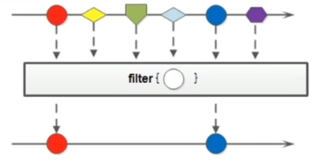
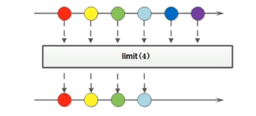
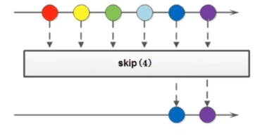
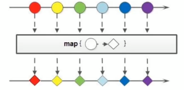
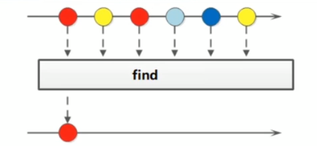
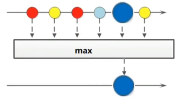
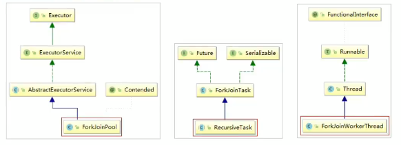
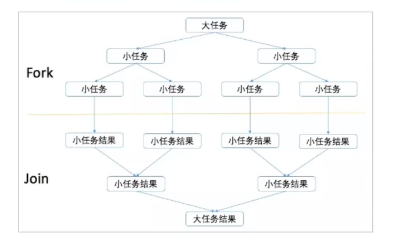
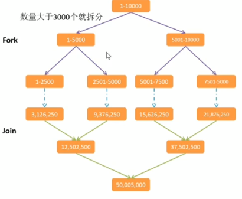

# 一、Lambda 表达式

## 1.1、需求分析 

​	创建一个新的线程，指定线程要执行的任务。

```java
public static void main(String[] args) {
        // 开启一个线程
        new Thread(new Runnable() {
            @Override
            public void run() {
                System.out.println("新线程中执行的代码：" + Thread.currentThread().getName());
            }
        }).start();
        System.out.println("主线程中的代码：" + Thread.currentThread().getName());
    }
```

代码分析：

1. Thread 类需要一个 Runnable  接口作为参数，其中抽象方法 run 方法是用来指定线程任务内容的核心。
2. 为了指定 run 方法体，不得不需要 Runnable 的实现类。
3. 为了省去定义一个 Runnable 的实现类，不得不使用匿名内部类。
4. 必须覆盖重写抽象的 run 方法，所有方法名称，方法参数，方法返回值不得不都重写一遍，而且不能出错。
5. 而实际上，我们只在乎方法体中的代码。

## 1.2、Lambda 的使用

​	Lambda 表达式是一个匿名函数，可以理解为一段可以传递的代码。

```java
new Thread(() -> {
            System.out.println("新线程 Lambda 表达式..." + Thread.currentThread().getName());
        }).start();
```

​	Lambda 表达式的优点：简化了匿名内部类的使用，语法更加简单。

​	匿名内部类语法冗余，体验了 Lambda 表达式后，发现 Lambda 表达式是简化匿名内部类的一种方式。

## 1.3、Lambda 的语法规则

​	Lambda 省去了面向对象的条条框框，Lambda 的标准格式由 3 个部分组成：

```java
(参数类型 参数名称) -> {
    代码体
}
```

## 1.4、Lambda 练习

### 1.4.1、练习1

​	练习无参无返回值的 Lambda

​	定义一个接口：

```java
public interface UserService {
    void show();
}
```

​	主方法调用：

```java
public class Demo02Lambda {

    public static void main(String[] args) {
        goShow(new UserService() {
            @Override
            public void show() {
                System.out.println("show 方法执行了");
            }
        });
        System.out.println("---------------------");
        goShow(() -> {
            System.out.println("lambda show 执行了");
        });
        System.out.println("---------------------");
        goShow(() -> System.out.println("lambda show 1 方法执行了"));
    }

    public static void goShow(UserService userService) {
        userService.show();
    }
}
```

​	输出：

```bash
show 方法执行了
---------------------
lambda show 执行了
---------------------
lambda show 1 方法执行了
```

### 1.4.2、练习2

​	练习有参有返回值的 Lambda 表达式

​	创建一个 Person 对象：

```java
@Data
@AllArgsConstructor
@NoArgsConstructor
public class Person {
    private String name;
    private Integer age;
    private Integer height;
}
```

​	然后我们在 List 集合中保存多个 Person 对象，然后对这些对象做 age 排序操作。

```java
 public static void main(String[] args) {
        List<Person> list = new ArrayList<>();
        list.add(new Person("周杰伦", 33, 175));
        list.add(new Person("刘德华", 43, 185));
        list.add(new Person("周星驰", 38, 177));
        list.add(new Person("郭富城", 23, 170));

               Collections.sort(list, new Comparator<Person>() {
            @Override
            public int compare(Person o1, Person o2) {
                return o1.getAge() - o2.getAge();
            }
        });

        for (Person person : list) {
            System.out.println(person);
        }
    }
```

​	我们发现在 sort 方法的第二次参数是一个 Comparator 接口的匿名内部类，且执行的方法有参数和返回值，那么我们可以改写为 Lambda 表达式。

```java
public static void main(String[] args) {
        List<Person> list = new ArrayList<>();
        list.add(new Person("周杰伦", 33, 175));
        list.add(new Person("刘德华", 43, 185));
        list.add(new Person("周星驰", 38, 177));
        list.add(new Person("郭富城", 23, 170));

        Collections.sort(list, (Person o1, Person o2) -> {
            return o1.getAge() - o2.getAge();
        });

        for (Person person : list) {
            System.out.println(person);
        }
    }
```

​	输出：

```bash
Person(name=郭富城, age=23, height=170)
Person(name=周杰伦, age=33, height=175)
Person(name=周星驰, age=38, height=177)
Person(name=刘德华, age=43, height=185)
```

## 1.5、@FunctionalInterface

```
@FunctionalInterface
被该注解修饰的接口只能声明一个抽象方法
```

## 1.6、Lambda 表达式的原理

​	匿名内部类的本质是在编译时生成一个 Class 文件，XXXX$1.class

```java
public class Demo01Lambda {
    public static void main(String[] args) {
        // 开启一个线程
        new Thread(new Runnable() {
            @Override
            public void run() {
                System.out.println("新线程中执行的代码：" + Thread.currentThread().getName());
            }
        }).start();
        System.out.println("主线程中的代码：" + Thread.currentThread().getName());

        System.out.println("-------------------------------------------------------");

        new Thread(() -> {
            System.out.println("新线程 Lambda 表达式..." + Thread.currentThread().getName());
        }).start();
    }
}
```


​	还可以通过反编译工具来查看生成的代码：Xjad 工具。

```java
static class Demo01Lambda$1
	implements Runnable
{

	public void run()
	{
		System.out.println((new StringBuilder()).append("新线程中执行的代码：").append(Thread.currentThread().getName()).toString());
	}

	Demo01Lambda$1()
	{
	}
}
```

​	那么 Lambda 表达式的原理是什么呢


写有 Lambda 表达式的 class 文件，通过 Xjad 查看报错，这是可以通过 JDK 自带的工具：javap 对字节码进行反汇编操作。

```shell
javap -c -p 文件名.class
-c：表示对代码进行反汇编
-p：显示所有的类和成员
```

​	反汇编的结果：

```java
Compiled from "Demo02Lambda.java"
public class com.moriaty.jdk.lambda.Demo02Lambda {
  public com.moriaty.jdk.lambda.Demo02Lambda();
    Code:
       0: aload_0
       1: invokespecial #1                  // Method java/lang/Object."<init>":()V
       4: return

  public static void main(java.lang.String[]);
    Code:
       0: invokedynamic #2,  0              // InvokeDynamic #0:show:()Lcom/moriaty/jdk/lambda/service/UserService;
       5: invokestatic  #3                  // Method goShow:(Lcom/moriaty/jdk/lambda/service/UserService;)V
       8: return

  public static void goShow(com.moriaty.jdk.lambda.service.UserService);
    Code:
       0: aload_0
       1: invokeinterface #4,  1            // InterfaceMethod com/moriaty/jdk/lambda/service/UserService.show:()V
       6: return

  private static void lambda$main$0();
    Code:
       0: getstatic     #5                  // Field java/lang/System.out:Ljava/io/PrintStream;
       3: ldc           #6                  // String lambda show ִ▒▒▒▒
       5: invokevirtual #7                  // Method java/io/PrintStream.println:(Ljava/lang/String;)V
       8: return
}

```

​	在这个反编译的源码中，我们看到了一个静态方法 lambda\$main$0()，我们可以通过 debug 查看他做了什么


上面的项目可以理解为如下：

```java
public class Demo02Lambda{
    public static void main(String[] args){
        ...
    }
    
    private static void lambda$main$0(){
        System.out.println("lambda show 执行了");
    }
}
```

​	为了更加直观的理解，我们可以在运行的时候添加 `-Djdk.internal.lambda.dumpProxyClasses`，加上这个参数会将内部 class 码输出到一个文件中。

```shell
-Djdk.internal.lambda.dumpProxyClasses
```

​	命令执行：

```shell
java -Djdk.internal.lambda.dumpProxyClasses com.moriaty.jdk.lambda.Demo02Lambda
lambda show 执行了
```

​	生成文件：


​	反编译后：


​	我们可以看到匿名的内部类实现了 UserService 接口，并重写了 show() 方法，在 show 方法中调用了 Demo02Lambda.lambda\$main$0，也就是调用了 Lambda 中的内容。

​	等价于：

```java
public class Demo02Lambda {

    public static void main(String[] args) {
        goShow(new UserService() {
            @Override
            public void show() {
                Demo02Lambda.lambda$main$0();
            }
        });
    }

    private static void lambda$main$0() {
        System.out.println("lambda show 执行了");
    }
}

```

小结：

匿名内部类在编译的时候会产生一个 class 文件。

Lambda 表达式在程序运行的时候会形成一个类。

1. 在类中新增了一个方法，这个方法的方法体就是 Lambda 表达式中的代码。
2. 还会形成一个匿名内部类，实现接口，重写抽象方法。
3. 在接口中重写方法会调用新生成的方法。

## 1.7、Lambda 的省略写法

​	在 Lambda 表达式的标准写法的基础上，可以使用省略写法的规则为：

1. 小括号内的参数类型可以省略
2. 如果小括号内有且仅有一个参数，则小括号可以省略
3. 如果大括号内有且仅有一个语句，可以同时省略大括号，return 关键字及语句分号。

```java
public class Demo04Lambda {

    public static void main(String[] args) {
        goStudent((String name, Integer age) -> {
            return name + age + " 666666";
        });

        // 省略写法
        goStudent((name, age) -> name + age + " 666666");

        goOrder((String name) -> {
            System.out.println(name);
            return 22;
        });

        // 省略写法
        goOrder(name -> 222);
    }

    public static void goStudent(StudentService studentService) {
        studentService.show("张三", 22);
    }

    public static void goOrder(OrderService orderService) {
        orderService.show("李四");
    }
}
```

## 1.8、Lambda 的使用前提

​	Lambda 表达式的语法是非常简洁的，但是 Lambda 表达式不是随便使用的，使用时有几个条件要特别注意。

1. 方法的参数或局部变量类型必须为接口，才能使用
2. 接口中有且仅有一个抽象方法 @FunctionalInterface

## 1.9、Lambda 和匿名内部类的区别

​	Lambda 和匿名内部类的对比：

1. 所需的类型不一样
   1. 匿名内部类的类型可以是类，抽象类，接口
   2. Lambda 表达式需要的类型必须是接口
2. 抽象方法的数量不一样
   1. 匿名内部类所需的接口中的抽象方法所需的数量是随意的
   2. Lambda 表达式所需的接口中只能有一个抽象方法
3. **实现原理不一样**
   1. **匿名内部类是在编译后形成一个 class**
   2. **Lambda 表达式是在程序运行的时候动态生成 class**

# 二、接口中新增的方法

## 2.1、JDK8 中接口的新增

​	在 JDK8 中针对接口有增强，在 JDK8 之前

```java
interface 接口名 {
    静态常量;
    抽象方法;
}
```

​	JDK8 之后对接口进行了增强，接口中可以有默认方法和静态方法。

```java
interface 接口名 {
    静态常量;
    抽象方法;
    默认方法;
    静态方法;
}
```

## 2.2、默认方法

### 2.2.1、为什么要增加默认方法

​	在 JDK8 之前接口中只能有抽象方法和静态常量，会存在以下问题：
​	如果接口中新增抽象方法，那么实现类都必须要重写这个抽象方法，非常不利于接口扩展。

### 2.2.2、接口默认方法的使用方式

​	接口中默认方法的语法是：

```java
interface 接口名 {
    default 返回值类型 方法名(参数) {
        方法体
    }
}
```

​	使用方法：

1. 实现类直接调用接口的默认方法
2. 实现类实现默认方法后调用

## 2.3、静态方法

​	JDK8 中为接口新增了静态方法，作用也是为了接口的扩展

## 2.3.1、语法规则

```java
interface 接口名 {
    static 返回值类型 方法名(参数) {
        方法体
    }
}
```

### 2.3.2、使用

​	接口中的静态方法在实现类中是不能被重写的，只能通过 接口名.静态方法名 调用。

## 2.4、两者的区别

1. 默认方法通过实例调用，静态方法通过接口名调用
2. 默认方法可以被继承，实现类可以直接调用接口默认方法，也可以重写默认方法
3. 静态方法不能被继承，实现类不能重写接口的静态方法，只能使用接口名调用

# 三、函数式接口

## 3.1、函数式接口的由来

​	使用 Lambda 表达式的前提是需要有函数式接口，而 Lambda 表达式使用时不关心接口名，抽象方法名。只关心抽象方法的参数列表和返回值类型。所以 JDK 提供了大量常用的函数式接口。

## 3.2、函数式接口介绍

​	在 JDK 中提供的函数式接口，主要在 java.util.function 包中。

### 3.2.1、Supplier

​	生产数据。

​	无参有返回值的接口，对于 Lambda 表达式需要提供一个返回数据的类型。

```java
@FunctionalInterface
public interface Supplier<T> {

    /**
     * Gets a result.
     *
     * @return a result
     */
    T get();
}
```

​	使用：

```java
public class SupplierTest {

    public static void main(String[] args) {
        func1(() -> {
            int[] arr = {22, 33, 44, 55, 1, 2, 909, 2100};
            // 计算出数组中的最大值
            Arrays.sort(arr);
            return arr[arr.length - 1];
        });
    }

    private static void func1(Supplier<Integer> supplier) {
        // get 是一个无参数有返回值的抽象方法
        Integer max = supplier.get();
        System.out.println("max = " + max);
    }
}
```


### 3.2.2、Consumer

​	消费数据。

```java
@FunctionalInterface
public interface Consumer<T> {

    /**
     * Performs this operation on the given argument.
     *
     * @param t the input argument
     */
    void accept(T t);

    /**
     * Returns a composed {@code Consumer} that performs, in sequence, this
     * operation followed by the {@code after} operation. If performing either
     * operation throws an exception, it is relayed to the caller of the
     * composed operation.  If performing this operation throws an exception,
     * the {@code after} operation will not be performed.
     *
     * @param after the operation to perform after this operation
     * @return a composed {@code Consumer} that performs in sequence this
     * operation followed by the {@code after} operation
     * @throws NullPointerException if {@code after} is null
     */
    default Consumer<T> andThen(Consumer<? super T> after) {
        Objects.requireNonNull(after);
        return (T t) -> { accept(t); after.accept(t); };
    }
}

```

​	使用：将输入的数据统一转换为小写

```java
public class ConsumerTest {

    public static void main(String[] args) {
        test(msg -> {
            System.out.println(msg + " -> " + msg.toLowerCase(Locale.ROOT));
        });
    }

    public static void test(Consumer<String> consumer) {
        consumer.accept("Hello World");
    }
}
```

​	默认方法：andThen

​	如果一个方法的参数和返回值的类型都是 Consumer 时，那么可以通过 andThen 实现组合调用的效果。

```java
public class ConsumerTest {

    public static void main(String[] args) {

        test3(msg1 -> {
            System.out.println(msg1 + " -> " + msg1.toLowerCase(Locale.ROOT));
        }, msg2 -> {
            System.out.println(msg2 + " -> " + msg2.toUpperCase(Locale.ROOT));
        });
    }

    public static void test3(Consumer<String> c1, Consumer<String> c2) {
        String str = "Hello World";
        c1.andThen(c2).accept(str);
    }
}
```


### 3.2.3、Function

​	有参数有返回值的类型，Function 接口是根据一个类型的数据得到另一个类型的数据，前者称为前置条件，后者称为后置条件。

````java
@FunctionalInterface
public interface Function<T, R> {

    /**
     * Applies this function to the given argument.
     *
     * @param t the function argument
     * @return the function result
     */
    R apply(T t);

    /**
     * Returns a composed function that first applies the {@code before}
     * function to its input, and then applies this function to the result.
     * If evaluation of either function throws an exception, it is relayed to
     * the caller of the composed function.
     *
     * @param <V> the type of input to the {@code before} function, and to the
     *           composed function
     * @param before the function to apply before this function is applied
     * @return a composed function that first applies the {@code before}
     * function and then applies this function
     * @throws NullPointerException if before is null
     *
     * @see #andThen(Function)
     */
    default <V> Function<V, R> compose(Function<? super V, ? extends T> before) {
        Objects.requireNonNull(before);
        return (V v) -> apply(before.apply(v));
    }

    /**
     * Returns a composed function that first applies this function to
     * its input, and then applies the {@code after} function to the result.
     * If evaluation of either function throws an exception, it is relayed to
     * the caller of the composed function.
     *
     * @param <V> the type of output of the {@code after} function, and of the
     *           composed function
     * @param after the function to apply after this function is applied
     * @return a composed function that first applies this function and then
     * applies the {@code after} function
     * @throws NullPointerException if after is null
     *
     * @see #compose(Function)
     */
    default <V> Function<T, V> andThen(Function<? super R, ? extends V> after) {
        Objects.requireNonNull(after);
        return (T t) -> after.apply(apply(t));
    }

    /**
     * Returns a function that always returns its input argument.
     *
     * @param <T> the type of the input and output objects to the function
     * @return a function that always returns its input argument
     */
    static <T> Function<T, T> identity() {
        return t -> t;
    }
}
````

​	使用方法：

```java
public class FunctionTest {
    public static void main(String[] args) {
        test(msg -> {
            return Integer.parseInt(msg)
        });
    }

    public static void test(Function<String, Integer> function) {
        Integer apply = function.apply("666");
        System.out.println("apply = " + apply);
    }
}
```

​	默认方法：andThen，也是用来进行组合操作。compose，作用和 andThen 一致，顺序正好相反。

​	静态方法：identity 输入什么返回什么。

### 3.2.4、Predicate

```java
@FunctionalInterface
public interface Predicate<T> {

    /**
     * Evaluates this predicate on the given argument.
     *
     * @param t the input argument
     * @return {@code true} if the input argument matches the predicate,
     * otherwise {@code false}
     */
    boolean test(T t);

    /**
     * Returns a composed predicate that represents a short-circuiting logical
     * AND of this predicate and another.  When evaluating the composed
     * predicate, if this predicate is {@code false}, then the {@code other}
     * predicate is not evaluated.
     *
     * <p>Any exceptions thrown during evaluation of either predicate are relayed
     * to the caller; if evaluation of this predicate throws an exception, the
     * {@code other} predicate will not be evaluated.
     *
     * @param other a predicate that will be logically-ANDed with this
     *              predicate
     * @return a composed predicate that represents the short-circuiting logical
     * AND of this predicate and the {@code other} predicate
     * @throws NullPointerException if other is null
     */
    default Predicate<T> and(Predicate<? super T> other) {
        Objects.requireNonNull(other);
        return (t) -> test(t) && other.test(t);
    }

    /**
     * Returns a predicate that represents the logical negation of this
     * predicate.
     *
     * @return a predicate that represents the logical negation of this
     * predicate
     */
    default Predicate<T> negate() {
        return (t) -> !test(t);
    }

    /**
     * Returns a composed predicate that represents a short-circuiting logical
     * OR of this predicate and another.  When evaluating the composed
     * predicate, if this predicate is {@code true}, then the {@code other}
     * predicate is not evaluated.
     *
     * <p>Any exceptions thrown during evaluation of either predicate are relayed
     * to the caller; if evaluation of this predicate throws an exception, the
     * {@code other} predicate will not be evaluated.
     *
     * @param other a predicate that will be logically-ORed with this
     *              predicate
     * @return a composed predicate that represents the short-circuiting logical
     * OR of this predicate and the {@code other} predicate
     * @throws NullPointerException if other is null
     */
    default Predicate<T> or(Predicate<? super T> other) {
        Objects.requireNonNull(other);
        return (t) -> test(t) || other.test(t);
    }

    /**
     * Returns a predicate that tests if two arguments are equal according
     * to {@link Objects#equals(Object, Object)}.
     *
     * @param <T> the type of arguments to the predicate
     * @param targetRef the object reference with which to compare for equality,
     *               which may be {@code null}
     * @return a predicate that tests if two arguments are equal according
     * to {@link Objects#equals(Object, Object)}
     */
    static <T> Predicate<T> isEqual(Object targetRef) {
        return (null == targetRef)
                ? Objects::isNull
                : object -> targetRef.equals(object);
    }
}
```

​	使用方法：

```java
public class PredicateTest {
    public static void main(String[] args) {
        test(msg -> {
            return msg.length() > 3;
        }, "a");
    }

    private static void test(Predicate<String> predicate, String msg) {
        boolean b = predicate.test(msg);
        System.out.println("b = " + b);
    }
}
```

​	在 Predicate 中的默认方法提供了逻辑关系操作：and，or，negate，isEqual。

```java
public class PredicateTest {
    public static void main(String[] args) {
        
        test2(msg1 -> {
            return msg1.contains("H");
        }, msg2 -> {
            return msg2.contains("W");
        });
    }

    private static void test2(Predicate<String> p1, Predicate<String> p2) {
        boolean b1 = p1.and(p2).test("Hello");
        boolean b2 = p1.or(p2).test("Hello");
        boolean b3 = p1.negate().test("Hello");
        System.out.println(b1);
        System.out.println(b2);
        System.out.println(b3);
    }
}
```

# 四、方法引用

 ## 4.1、为什么要使用方法引用

### 4.1.1、Lambda 表达式冗余

​	在使用 Lambda 表达式之后也会出现代码冗余的情况。比如：用 Lambda 表达式求一个数组的和。

```java
public class FunctionRefTest01 {
    public static void main(String[] args) {
        printMax(a -> {
            // Lambda 表达式中的代码和 getTotal 代码冗余
            int sum = 0;
            for (int i : a) {
                sum += i;
            }
            System.out.println("sum = " + sum);
        });
    }

    public static void getTotal(int[] a) {
        int sum = 0;
        for (int i : a) {
            sum += i;
        }
        System.out.println("sum = " + sum);
    }

    private static void printMax(Consumer<int[]> consumer) {
        int[] arr = {10, 20, 30, 40, 50, 60};
        consumer.accept(arr);
    }
}
```

### 4.1.2、解决方法

```java
public class FunctionRefTest01 {
    public static void main(String[] args) {
        // :: 方法引用
        printSum(FunctionRefTest01::getTotal);
    }

    public static void getTotal(int[] a) {
        int sum = 0;
        for (int i : a) {
            sum += i;
        }
        System.out.println("sum = " + sum);
    }

    private static void printSum(Consumer<int[]> consumer) {
        int[] arr = {10, 20, 30, 40, 50, 60};
        consumer.accept(arr);
    }
}
```

## 4.2、方法引用格式

​	符号表示：`::`

​	符号说明：双冒号为方法引用运算符，而它所在的表达式成为方法引用

​	应用场景：如果 Lambda 表达式所需要实现的方案，已经有其他方法存在相同的方案，那么可以使用方法引用。

​	常见的引用方式：

​	方法引用在 JDK8 中是相当灵活的，有以下几种形式：

1. 对象::方法名
2. 类名::静态方法
3. 类名::普通方法
4. 类名:: new 调用的构造器
5. 类名[]:: new 调用数组的构造器

### 4.2.1、对象::方法名

​	这是最常见的一种用法，如果一个类中已经存在了一个成员方法，则可以通过对象名引用成员方法。

```java
public class FunctionRefTest02 {
    public static void main(String[] args) {
        Date now = new Date();
        Supplier<Long> supplier = () -> now.getTime();
        System.out.println(supplier.get());

        // 通过方法引用使用
        Supplier<Long> supplier1 = now::getTime;
        System.out.println(supplier1.get());
    }

}
```

​	注意事项：

1. 被引用的方法，参数要和接口中的抽象方法的参数一致
2. 当接口抽象方法有返回值的时候，被引用的方法也必须有返回值

### 4.2.2、类名::静态方法

```java
public class FunctionRefTest03 {
    public static void main(String[] args) {
        Supplier<Long> supplier = () -> {
            return System.currentTimeMillis();
        };
        System.out.println(supplier.get());

        // 通过方法引用实现
        Supplier<Long> supplier1 = System::currentTimeMillis;
        System.out.println(supplier1.get());

    }
}
```


### 4.2.3、类名::普通方法

​	JAVA 面向对象中，类名只能调用静态方法，类名引用实例方法是用前提的，实际上是拿第一个参数做为方法的调用者。

```java
public class FunctionRefTest04 {
    public static void main(String[] args) {
        Function<String, Integer> function = (s) -> {
            return s.length();
        };
        System.out.println(function.apply("Hello"));

        // 通过方法引用来实现
        Function<String, Integer> function1 = String::length;
        System.out.println(function1.apply("Hello"));

        BiFunction<String, Integer, String> function2 = String::substring;
        System.out.println(function2.apply("HelloWorld", 3));
    }

}
```


### 4.2.4、类名::构造器

​	由于构造器的名称和类名完全一致，所以可以使用 类名::new 使用。

```java
public class FunctionRefTest05 {
    public static void main(String[] args) {
        Supplier<Person> supplier = () -> {
            return new Person();
        };
        System.out.println(supplier.get());

        // 通过方法引用来实现
        Supplier<Person> supplier1 = Person::new;
        System.out.println(supplier1.get());

        BiFunction<String, Integer, Person> function = Person::new;
        System.out.println(function.apply("张三", 13));
    }

}
```


### 4.2.5、数组::构造器

```java
public class FunctionRefTest06 {
    public static void main(String[] args) {
        Function<Integer, String[]> function1 = (len) -> {
            return new String[len];
        };
        System.out.println(function1.apply(4).length);

        // 方法引用
        Function<Integer, String[]> function2 = String[]::new;
        System.out.println(function2.apply(10).length);
    }

}
```

## 4.3、小结

​	方法引用是对 Lambda 表达式符合特定情况下的一种缩写形式，它使得我们的 Lambda 表达式更加精简，也可以理解为 Lambda 表达式的缩写形式。不过要注意方法引用只能引用已经存在的方法，

# 五、Stream API

## 5.1、集合处理数据的弊端

​	当我们在需要对集合中的元素进行操作的时候，除了必须的添加，删除，获取以外，最典型的操作就是集合遍历。

```java
public class StreamTest1 {
    public static void main(String[] args) {
        List<String> list = Arrays.asList("张三", "李四", "王五无");

        // 获取所有姓张的信息
        List<String> list1 = new ArrayList<>();
        for (String s : list) {
            if (s.startsWith("张")) {
                list1.add(s);
            }
        }

        // 获取所有姓名长度为 3 的用户
        List<String> list2 = new ArrayList<>();
        for (String s : list) {
            if (s.length() == 3) {
                list2.add(s);
            }
        }

        System.out.println(list1);
        System.out.println(list2);
    }
}
```

​	一旦对集合的数据进行操作，就需要对集合进行循环。使用 Stream 更加优雅的解决。

```java
public class StreamTest2 {
    public static void main(String[] args) {
        List<String> list = Arrays.asList("张三风", "李四", "王五无");

        // 获取所有姓张的信息
        // 获取所有姓名长度为 3 的用户
        list.stream()
                .filter(s -> s.startsWith("张"))
                .filter(s -> s.length() == 3)
        .forEach(System.out::println);

    }
}
```

## 5.2、Stream 流式思想概述

​	注意：Stream 和 IO 流（InputStream/OutputStream）没有任何关系。

​	Stream 流式思想类似于工厂车间的“生产流水线”，Stream 流不是一种数据结构，不保存数据，而是对数据进行加工处理。Stream 可以看做是流水线上的一个工序。在流水线上，通过多个工序让一个原材料加工成一个商品。

​	Stream API 能让我们快速完成许多复杂的操作，如筛选、切片、映射、查找、去重、统计、匹配和规约。

## 5.3、Stream 流的获取方式

### 5.3.1、根据 Collection 获取

​	首先，Collection 加入了一个 default 方法：stream。也就是说 Collection 接口下的所有对象都可以使用 stream 来获取流。

```java
public static void main(String[] args) {
        List<String> list = new ArrayList<>();
        list.stream();
        Set<String> set = new HashSet<>();
        set.stream();
        Vector<String> vector = new Vector<>();
        vector.stream();
    }
```

​	但是，Map 接口并没有实现 Collection 接口，此时可以根据 Map 获取对应的 key value 的集合。

```java
public static void main(String[] args) {
        Map<String, Object> map = new HashMap<>();
        map.keySet().stream();
        map.values().stream();
        map.entrySet().stream();
    }
```


### 5.3.2、通过 Stream 的 of 方法

​	在开发中会操作到数组中的数据，数组对象不可能添加默认方法，所有 Stream 接口中提供了静态方法 of。

```java
public class StreamTest5 {
    public static void main(String[] args) {
        Stream.of("a1", "a2", "a3");
        String[] arr1 = {"aa", "bb", "cc"};
        Stream<String> arr11 = Stream.of(arr1);
        arr11.forEach(System.out::println);

        Integer[] arr2 = {1, 2, 3, 4};
        Stream<Integer> arr21 = Stream.of(arr2);
        arr21.forEach(System.out::println);

        // 注意：基本数据类型的数组是不行的
        int[] arr3 = {1, 2, 3, 4};
        Stream<int[]> arr31 = Stream.of(arr3);
        arr31.forEach(System.out::println);
    }
}
```

## 5.4、Stream 常用方法介绍

| 方法名  | 方法作用   | 返回值类型 | 方法种类 |
| ------- | ---------- | ---------- | -------- |
| count   | 统计个数   | long       | 终结     |
| forEach | 逐一处理   | void       | 终结     |
| filter  | 过滤       | Stream     | 函数拼接 |
| limit   | 取用前几个 | Stream     | 函数拼接 |
| skip    | 跳过前几个 | Stream     | 函数拼接 |
| map     | 映射       | Stream     | 函数拼接 |
| concat  | 组合       | Stream     | 函数拼接 |

**终结方法：**返回值类型不再是 Stream 类型的方法，不再支持链式调用。终结方法包裹 count 和 forEach。

**非终结方法：**返回值类型仍然是 Stream 类型的方法，支持链式调用。（除了终结方法外，其余都是非终结方法。）

**Stream 注意：**

1. Stream 只能操作一次
2. Stream 方法返回是个新的流
3. Stream 方法不调用终结方法，中间方法是不会调用的。

### 5.4.1、forEach

​	用于遍历流中的数据

```java
void forEach(Consumer<? super T> action);
```

​	该方法接受一个 Consumer 接口，会将每一个流元素交给函数处理。

```java
 public static void main(String[] args) {
        Stream.of("a1", "a2", "b3")
                .forEach(System.out::println);
    }
```

### 5.4.2、count

​	用于统计流中元素的个数

```java
long count();
```

​	该方法返回一个 long，代表个数。

```java
public static void main(String[] args) {
        long count = Stream.of("a1", "a2", "b3").count();
        System.out.println(count);
    }
```

### 5.4.3、filter

​	用于过滤数据，返回符合条件的数据。



​	通过 filter 方法将一个流转换成另一个子集流。

```java
Stream<T> filter(Predicate<? super T> predicate);
```

​	该接口接受一个 Predicate 接口作为筛选条件。

```java
public static void main(String[] args) {
        Stream.of("a1", "a2", "b3")
                .filter(s -> s.contains("a"))
                .forEach(System.out::println);
    }
```

### 5.4.4、limit

​	对流进行截取处理，只取前 N 个数据。

```java
Stream<T> limit(long maxSize);
```



```java
public static void main(String[] args) {
        Stream.of("a1", "a2", "b3")
                .limit(2)
                .forEach(System.out::println);
    }
```

​	如果集合长度大于参数，否则不操作。

### 5.4.5、skip

​	

​	如果期望跳过前面几个元素，可以使用 Skip 跳过。

```java
Stream<T> skip(long n);
```

```java
public static void main(String[] args) {
        Stream.of("a1", "a2", "b3")
                .skip(2)
                .forEach(System.out::println);
    }
```


### 5.4.6、map

​	如果我们需要将流中的元素映射到另一个流中，可以使用 map 方法。

```java
<R> Stream<R> map(Function<? super T, ? extends R> mapper);
```



​	该接口需要一个 Function 接口参数，可以将当前流中的 T 类型转换为 R 类型。

```java
public static void main(String[] args) {
        Stream.of("1", "2", "3", "4", "5", "6", "7")
                .map(Integer::parseInt)
                .forEach(System.out::println);
    }
```

### 5.4.7、sorted

​	将数据排序。

```java
Stream<T> sorted();
```

​	使用的时候可以根据自然排序，也可以根据指定的对应排序规则。

```java
public static void main(String[] args) {
        Stream.of("1", "3", "2", "0", "11", "6", "4")
                .map(Integer::parseInt)
                // 根据数据自然排序
                .sorted()
                // 根据比较器排序
                .sorted((o1, o2) -> o2 - o1)
                .forEach(System.out::println);
    }
```


### 5.4.8、distinct

​	用于去掉重复数据。

```java
Stream<T> distinct();
```


```java
public static void main(String[] args) {
        Stream.of("1", "3", "3", "0", "11", "6", "4")
                .map(Integer::parseInt)
                // 根据数据自然排序
                .sorted()
                // 根据比较器排序
                .sorted((o1, o2) -> o2 - o1)
                // 去掉重复记录
                .distinct()
                .forEach(System.out::println);
        Stream.of(
                new Person("张三", 18),
                new Person("李四", 19),
                new Person("张三", 18)
        ).distinct()
                .forEach(System.out::println);
    }
```

​	对于基本数据类型是可以直接去重，但是对于自定义类型，需要重写 hashCode 和 equal 方法来进行去重。

### 5.4.9、match

​	用于判断数据是否匹配指定的条件。

```java
// 任意满足条件
boolean anyMatch(Predicate<? super T> predicate);
// 全满足条件
boolean allMatch(Predicate<? super T> predicate);
// 不满足条件
boolean noneMatch(Predicate<? super T> predicate);
```

```java
public static void main(String[] args) {
        System.out.println(Stream.of("1", "3", "3", "3", "11", "6", "4")
                .map(Integer::parseInt)
                .allMatch(s -> s > 0));
        System.out.println(Stream.of("1", "3", "3", "3", "11", "6", "4")
                .map(Integer::parseInt)
                .anyMatch(s -> s > 4));
        System.out.println(Stream.of("1", "3", "3", "3", "11", "6", "4")
                .map(Integer::parseInt)
                .noneMatch(s -> s > 4));
    }
```

​	注意，Match 是一个终结方法。

### 5.4.10、find

​	用于找到某些元素。

```java
Optional<T> findFirst();
Optional<T> findAny();
```



```java
public static void main(String[] args) {
        Optional<String> first = Stream.of("1", "3", "3", "3", "11", "6", "4")
                .findFirst();
        System.out.println(first.get());
        Optional<String> any = Stream.of("1", "3", "3", "3", "11", "6", "4")
                .findAny();
        System.out.println(any.get());

    }
```

### 5.4.11、max 和 min

​	用于获取元素的最大值和最小值。



```java
Optional<T> max(Comparator<? super T> comparator);
Optional<T> min(Comparator<? super T> comparator);
```

```java
public static void main(String[] args) {
        Optional<Integer> max = Stream.of("1", "3", "3", "4", "5", "1", "7")
                .map(Integer::parseInt)
                .max((o1, o2) -> (o1 - o2));
        System.out.println(max.get());

        Optional<Integer> min = Stream.of("1", "3", "3", "4", "5", "1", "7")
                .map(Integer::parseInt)
                .min((o1, o2) -> (o1 - o2));
        System.out.println(min.get());
    }
```

### 5.4.12、reduce 方法


​	如果需要将所有数据归纳得到一个数据，那么可以使用这个 reduce 方法

```java
T reduce(T identity, BinaryOperator<T> accumulator);
```

```java
public static void main(String[] args) {
        Integer total = Stream.of(4, 5, 3, 9)
                // identity 默认值
                // 第一次会将默认值赋值给 x
                // 之后每一次都会将上一次操作结果赋值给 x, y 是每次从数据中获取的元素
                .reduce(0, (x, y) -> {
                    System.out.println("x=" + x + ", y=" + y);
                    return x + y;
                });
        System.out.println(total);

        Integer max = Stream.of(4, 5, 3, 9)
                .reduce(0, (x, y) ->
                        x > y ? x : y
                );
        System.out.println(max);
    }
```

### 5.4.13、map 和 reduce 组合

```java
public static void main(String[] args) {
        // 求出所有年龄的总和
        Integer sumAge = Stream.of(
                new Person("张三", 18),
                new Person("李四", 22),
                new Person("王五", 13),
                new Person("赵柳", 15),
                new Person("周期", 19))
                // 实现类型转换
                .map(Person::getAge)
                .reduce(0, Integer::sum);
        System.out.println(sumAge);

        // 求出所有年龄中的最大值
        Integer maxAge = Stream.of(
                new Person("张三", 18),
                new Person("李四", 22),
                new Person("王五", 13),
                new Person("赵柳", 15),
                new Person("周期", 19))
                .map(Person::getAge)
                .reduce(0, Math::max);
        System.out.println(maxAge);

        // 统计字符 a 出现的次数
        Integer count = Stream.of("a", "a", "c", "d", "a", "c", "a")
                .map(ch -> "a".equals(ch) ? 1 : 0)
                .reduce(0, Integer::sum);
        System.out.println(count);
    }
```

### 5.4.14、mapToInt

​	

```java
public static void main(String[] args) {
    // Integer 占用的内存比 int 多，在 Stream 流操作中会自动装箱和拆箱操作
    Integer[] arr = {1, 2, 3, 4, 5, 6, 7};
    Stream.of(arr)
            .filter(i -> i > 0)
            .forEach(System.out::println);
    // 为了提高效率，可以将流中的 Integer 转化为 int
    IntStream intStream = Stream.of(arr).mapToInt(Integer::intValue);
    intStream.filter(i -> i > 3)
            .forEach(System.out::println);
}
```

### 5.4.15、concat

​	如果有两个流希望合并成为一个流，可以使用 Stream 接口的静态方法 concat

```java
public static void main(String[] args) {
        Stream<String> stream1 = Stream.of("a", "b", "c");
        Stream<String> stream2 = Stream.of("x", "y", "z");
        Stream.concat(stream1, stream2)
                .forEach(System.out::println);
    }
```

### 5.4.16、综合案例

​	定义两个集合，然后在集合中存储多个用户名称，然后完成以下操作：

1. 第一个队伍只保留姓名长度为 3 的成员
2. 第一个队伍筛选之后只要前 3 个人
3. 第二个队伍只要姓张的队员
4. 第二个队伍筛选之后不要前两个人
5. 将两个队伍合并成一个
6. 根据姓名创建 Person 对象
7. 打印这个队伍的 Person 信息

```java
 public static void main(String[] args) {
        List<String> list1 = Arrays.asList("迪丽热巴", "宋远桥", "苏星河", "老子", "庄子", "孙子", "洪七 公");
        List<String> list2 = Arrays.asList("古力娜扎", "张无忌", "张三丰", "赵丽颖", "张二狗", "张天爱", "张三");

        // 1. 第一个队伍只保留姓名长度为 3 的成员
        // 2. 第一个队伍筛选之后只要前 3 个人
        Stream<String> stream1 = list1.stream()
                .filter(s -> s.length() == 3)
                .limit(3);

        // 3. 第二个队伍只要姓张的队员
        // 4. 第二个队伍筛选之后不要前两个人
        Stream<String> stream2 = list2.stream()
                .filter(s -> s.startsWith("张"))
                .skip(2);

        // 5. 将两个队伍合并成一个
        // 6. 根据姓名创建 Person 对象
        // 7. 打印这个队伍的 Person 信息
        Stream.concat(stream1, stream2)
                .map(Person::new)
                .forEach(System.out::println);
    }
```

## 5.5、Stream 结果收集

### 5.5.1、收集到集合

```java
public static void main(String[] args) {
        List<String> list = Stream.of("aa", "bb", "cc", "aa")
                .collect(Collectors.toList());
        System.out.println(list);

        Set<String> set = Stream.of("aa", "bb", "cc", "aa")
                .collect(Collectors.toSet());
        System.out.println(set);

        ArrayList<String> arrayList = Stream.of("aa", "bb", "cc", "aa")
                .collect(Collectors.toCollection(ArrayList::new));
        System.out.println(arrayList);

        HashSet<String> hashSet = Stream.of("aa", "bb", "cc", "aa")
                .collect(Collectors.toCollection(HashSet::new));
        System.out.println(hashSet);
    }
```


### 5.5.2、收集到数组

```java
public static void main(String[] args) {
        Object[] objects = Stream.of("aa", "bb", "cc", "aa")
                .toArray();
        System.out.println(Arrays.toString(objects));

        String[] strings = Stream.of("aa", "bb", "cc", "aa")
                .toArray(String[]::new);
        System.out.println(Arrays.toString(strings));

    }
```

### 5.5.3、对流中的数据做聚合计算

​	当使用 Stream 流处理数据后，可以像数据库的聚合函数一样对某个字段进行操作，比如获得最大值，求和等。

```java
public static void main(String[] args) {
        // 获取年龄的最大值
        Optional<Person> maxAge = Stream.of(
                new Person("张三", 18),
                new Person("李四", 22),
                new Person("王五", 13),
                new Person("赵柳", 15),
                new Person("周期", 19))
                .collect(Collectors.maxBy((p1, p2) -> p1.getAge() - p2.getAge()));
        System.out.println(maxAge.get());

        Optional<Person> minAge = Stream.of(
                new Person("张三", 18),
                new Person("李四", 22),
                new Person("王五", 13),
                new Person("赵柳", 15),
                new Person("周期", 19))
                .collect(Collectors.minBy((p1, p2) -> p1.getAge() - p2.getAge()));
        System.out.println(minAge.get());

        Integer sumAge = Stream.of(
                new Person("张三", 18),
                new Person("李四", 22),
                new Person("王五", 13),
                new Person("赵柳", 15),
                new Person("周期", 19))
                .collect(Collectors.summingInt(s -> s.getAge()));
        System.out.println(sumAge);

        Double avgAge = Stream.of(
                new Person("张三", 18),
                new Person("李四", 22),
                new Person("王五", 13),
                new Person("赵柳", 15),
                new Person("周期", 19))
                .collect(Collectors.averagingInt(Person::getAge));
        System.out.println(avgAge);

        Long count = Stream.of(
                new Person("张三", 18),
                new Person("李四", 22),
                new Person("王五", 13),
                new Person("赵柳", 15),
                new Person("周期", 19))
                .collect(Collectors.counting());
        System.out.println(count);
    }
```

### 5.5.4、对流中的数据做分组操作

```java
public static void main(String[] args) {
        Map<String, List<Person>> map1 = Stream.of(
                new Person("张三", 18, 175),
                new Person("李四", 22, 177),
                new Person("张三", 18, 165),
                new Person("李四", 15, 166),
                new Person("张三", 19, 182))
                .collect(Collectors.groupingBy(Person::getName));
        map1.forEach((k, v) -> System.out.println(k + ":" + v));

        // 根据年龄分组
        Map<String, List<Person>> map2 = Stream.of(
                new Person("张三", 18, 175),
                new Person("李四", 22, 177),
                new Person("张三", 18, 165),
                new Person("李四", 15, 166),
                new Person("张三", 19, 182))
                .collect(Collectors.groupingBy(p -> p.getAge() >= 18 ? "成年" : "未成年"));
        map2.forEach((k, v) -> System.out.println(k + ":" + v));

    }
```

### 5.5.5、多级分组

```java
public static void main(String[] args) {
        Map<String, Map<String, List<Person>>> map1 = Stream.of(
                new Person("张三", 18, 175),
                new Person("李四", 22, 177),
                new Person("张三", 18, 165),
                new Person("李四", 15, 166),
                new Person("张三", 19, 182))
                .collect(Collectors.groupingBy(Person::getName,
                        Collectors.groupingBy(p -> p.getAge() >= 18 ? "成年" : "未成年")));
        map1.forEach((k, v) -> {
            System.out.println(k + ":");
            v.forEach((kk, vv) -> System.out.println("  " + kk + "=" + vv));
        });
    }
```

### 5.5.6、分区操作

Collectors.partitioningBy 会根据值是否为 true，把集合中的数据分为两个列表，一个为 true 列表，一个为 false 列表。

```java
public static void main(String[] args) {
        Map<Boolean, List<Person>> map = Stream.of(
                new Person("张三", 18, 175),
                new Person("李四", 22, 177),
                new Person("张三", 18, 165),
                new Person("李四", 15, 166),
                new Person("张三", 19, 182))
                .collect(Collectors.partitioningBy(p -> p.getAge() > 18));
        map.forEach((k, v) -> System.out.println(k + "=" + v));
    }
```

### 5.5.7、拼接操作

Collectors.joining 会根据指定的字符，将数据拼接成一个字符串。

```java
public static void main(String[] args) {
        String s1 = Stream.of(
                new Person("张三", 18, 175),
                new Person("李四", 22, 177),
                new Person("张三", 18, 165),
                new Person("李四", 15, 166),
                new Person("张三", 19, 182))
                .map(Person::getName)
                .collect(Collectors.joining());
        System.out.println(s1);

        String s2 = Stream.of(
                new Person("张三", 18, 175),
                new Person("李四", 22, 177),
                new Person("张三", 18, 165),
                new Person("李四", 15, 166),
                new Person("张三", 19, 182))
                .map(Person::getName)
                .collect(Collectors.joining("_"));
        System.out.println(s2);

        String s3 = Stream.of(
                new Person("张三", 18, 175),
                new Person("李四", 22, 177),
                new Person("张三", 18, 165),
                new Person("李四", 15, 166),
                new Person("张三", 19, 182))
                .map(Person::getName)
                .collect(Collectors.joining("_", "###","$$$"));
        System.out.println(s3);
    }
```

## 5.6、并行的 Stream 流

### 5.6.1、串行的 Stream 流

​	在一个线程上面执行的流

```java
public static void main(String[] args) {
        // 串行流
        System.out.println(Stream.of(5, 6, 8, 10, 2)
                .filter(s -> {
                    System.out.println(Thread.currentThread().getName() + ":" + s);
                    return s > 3;
                })
                .count());
    }
```

### 5.6.2、并行流

​	parallelStream 其实就是一个并行执行的流，他通过默认的 ForkJoinPool，可以提高多线程任务的速度。

- 获取并行流

```java
List<Integer> list = new ArrayList<>();
        // 通过 list 接口直接获取并行流
        Stream<Integer> integerStream = list.parallelStream();
        // 将已有的串行流转化为并行流
        Stream<Integer> parallel = Stream.of(1, 2, 3).parallel();
        
```

- 操作

```java
System.out.println(Stream.of(1, 4, 2, 6, 1, 5)
                .parallel()
                .filter(s -> {
                    System.out.println(Thread.currentThread().getName() + ":" + s);
                    return s > 2;
                }).count());
```

### 5.6.3、并行流和串行流对比

​	数据量大的情况下，并行流有有优势。

```java
public static void main(String[] args) {
        long times = 500000000;

        System.out.println("普通 for 循环");
        long start = System.currentTimeMillis();
        System.out.println(start);
        long res = 0;
        for (int i = 0; i < times; i++) {
            res += i;
        }
        System.out.println(res);
        System.out.println(System.currentTimeMillis() - start);


        System.out.println("串行流 for 循环");
        LongStream longStream = LongStream.rangeClosed(0, times);
        start = System.currentTimeMillis();
        System.out.println(longStream.reduce(0, Long::sum));
        System.out.println(System.currentTimeMillis() - start);

        System.out.println("并行流 for 循环");
        longStream = LongStream.rangeClosed(0, times);
        start = System.currentTimeMillis();
        System.out.println(start);
        System.out.println(longStream.parallel().reduce(0, Long::sum));
        System.out.println(System.currentTimeMillis() - start);

    }
```

### 5.6.4、线程安全问题

​	多线程的情况下会出现线程安全问题。

```java
public static void main(String[] args) {
        // 并行流中的数据安全问题
        List<Integer> list = new ArrayList<>();
        for (int i = 0; i < 1000; i++) {
            list.add(i);
        }
        System.out.println(list.size());

        // 使用并行流向集合中添加数据
        List<Integer> newList = new ArrayList<>();
        list.parallelStream().forEach(newList::add);
        System.out.println(newList.size());
    }
```

​	针对数据安全问题，我们的解决方案有哪些呢？

1. 加同步锁

2. 使用线程安全的容器

3. 将容器包装为线程安全的容器

   `Collections.synchronizedList()`

4. 通过 Stream 中的 toArray 或者 collect 进行操作

## 5.7、Fork/Join 框架

​	parallelStream 使用的是 Fork/Join 框架，框架自 JDK1.7 引入。Fork/Join 框架可以将一个大任务拆分成很多小任务来异步执行。

Fork/Join 框架主要有三个模块：

1. 线程池：ForkJoinPool
2. 任务对象：ForkJoinTask
3. 执行任务的线程：ForkJoinWorkerThread



### 5.7.1、Fork/Join 原理：分治法

​	ForkJoinPool 主要用分治法来解决问题、典型的应用比如快速排序算法，ForkJoinPool 需要使用相对较少的线程来处理大量的任务。比如对于 1000 万个数据进行排序，会将这个任务分割成两个500 万的任务和针对这两个任务的合并任务。



### 5.7.2、Fork/Join 原理：工作窃取算法

​	Fork/Join 工作窃取算法指的是某个线程从其他任务队列里窃取任务来执行。


### 5.7.3、Fork/Join 案例

​	使用 Fork/Join 计算 1-10000 的和，当一个任务的计算数量大于 3000 的时候拆分任务，数量小于 3000 就进行计算。



```java
public class StreamTest32ForkJoin {
    public static void main(String[] args) {
        ForkJoinPool pool = new ForkJoinPool();
        SumRecursiveTask task = new SumRecursiveTask(1, 10000L);
        Long result = pool.invoke(task);
        System.out.println("result=" + result);
    }
}

class SumRecursiveTask extends RecursiveTask<Long> {

    /**
     * 拆分的临界值
     */
    private static final long THRESHOLD = 3000L;

    private final long start;

    private final long end;

    public SumRecursiveTask(long start, long end) {
        this.start = start;
        this.end = end;
    }

    @Override
    protected Long compute() {
        long length = end - start;
        if (length <= THRESHOLD) {
            // 任务无需拆分
            long sum = 0;
            for (long i = start; i <= end; i++) {
                sum += i;
            }
            System.out.println("计算：" + start + "-->" + end + ", 的结果为：" + sum);
            return sum;
        } else {
            long middle = (start + end) / 2;
            System.out.println("拆分：左边 " + start + "-->右边：" + end);
            SumRecursiveTask left = new SumRecursiveTask(start, middle);
            left.fork();
            SumRecursiveTask right = new SumRecursiveTask(middle + 1, end);
            right.fork();
            return left.join() + right.join();
        }
    }
}
```

# 六、Optional

​	Optional 是用来解决空指针的问题

## 6.1、以前解决 null 的方法

```java
public static void main(String[] args) {
        String username = "张三";
        if (username != null) {
            System.out.println(username.length());
        } else {
            System.out.println("空");
        }
    }
```

## 6.2、Optional 类

​	Optional 是 final，是一个没有子类的工具类，是一个可以为 null 的容器对象，他的主要作用就是为了避免 Null 检查，防止 NullPointerException。

## 6.3、基本使用

​	创建方式：

```java
 public static void main(String[] args) {
        // of 方法不支持传入 null
        Optional<String> op1 = Optional.of("张三");
        Optional<Object> op2 = Optional.of(null);

        // ofNullable 支持 null
        Optional<String> op3 = Optional.ofNullable("lisi");
        Optional<Object> op4 = Optional.ofNullable(null);

        // empty 直接创建空对象
        Optional<Object> op5 = Optional.empty();
    }
```

​	常用方法：

```java
public static void main(String[] args) {
        Optional<String> op1 = Optional.of("张三");
        Optional<String> op2 = Optional.empty();

        /*
         获取 Optional 的值：get()
         */
        System.out.println(op1.get());
        // get 方法没有值会抛出 NoSuchElementException 异常

        /*
         判断是否有值：isPresent()
         */
        if (op2.isPresent()) {
            System.out.println("空");
        }

        /*
        赋予默认值：orElse()
        如果是空值，则返回 orElse 的值
         */
        System.out.println(op2.orElse("王五"));

        /*
        orElseGet()
        与 orElse() 方法类似
         */
        System.out.println(op2.orElseGet(() -> "hello"));

    }
```

​	高级用法：

```java
public class OptionalTest03 {
    public static void main(String[] args) {
        Optional<String> op1 = Optional.of("张三");
        Optional<String> op2 = Optional.empty();

        /*
        ifPresent
         如果存在值，就做什么
         */
        op1.ifPresent(System.out::println);

        /*
        自定义一个方法，将 Person 对象中的 name 转换为大写，并返回
         */
        Person p = new Person("zhansan", 18);
        Optional<Person> op = Optional.of(p);
        System.out.println(getName(p));
        System.out.println(getNameForOptional(op));

    }

    private static String getNameForOptional(Optional<Person> op) {
        String res = null;
        if (op.isPresent()) {
            return op.map(Person::getName)
                    .map(String::toUpperCase)
                    .orElse(null);
        }
        return res;
    }

    private static String getName(Person person) {
        if (person != null) {
            String name = person.getName();
            if (name != null) {
                return name.toUpperCase(Locale.ROOT);
            } else {
                return null;
            }
        } else {
            return null;
        }
    }
}
```

# 七、新时间日期 API

## 7.1、旧版日期时间的问题

​	在旧版本中，JDK 对于日期时间的设计是不好的。

```java
public static void main(String[] args) throws ParseException {
        /*
        旧版日期时间存在的问题
         */
        // 1、设计不合理
        Date date = new Date(2021,07, 06);
        System.out.println(date);

        // 2、时间格式化
        SimpleDateFormat sdf = new SimpleDateFormat("yyyy-MM-dd");
        System.out.println(sdf.format(date));
        System.out.println(sdf.parse("2021-05-06"));

        // 3、多线程的情况下会存在数据安全问题
        for (int i = 0; i < 50; i++) {
            new Thread(()-> {
                try {
                    System.out.println(sdf.parse("2021-05-06"));
                } catch (ParseException e) {
                    e.printStackTrace();
                }
            }).start();
        }
    
    	// 4、存在时区问题
    }
```

## 7.2、新日期时间 API 介绍

​	JDK8 增加了一套全新的日期时间 API，是线程安全的，下面是一些关键类：

- LocalDate：表示日期，格式 2021-07-06
- LocalTime：表示时间，格式 11:36:14.154234300
- LocalDateTime：表示日期时间，格式 2021-07-06T11:36:14.154
- DateTimeFormatter：日期时间格式化类
- Instant：时间戳
- Duration：用于计算两个时间（LocalTime）的距离
- Period：用户计算连个日期（LocalDate）的距离
- ZoneDateTime：包含时区的时间

​	Java 使用的历法是 ISO 8601 日历系统，也就是公历，此外 JDK 还提供了 4 套其他历法，分别是：

- ThaiBuddhistDate：泰国佛教历
- MinguoDate：中华民国历
- JapaneseDate：日本历
- HijrahDate：伊斯兰历

### 7.2.1、常见操作

```java
public static void main(String[] args) {

        // 创建指定的日期
        System.out.println(LocalDate.of(2021, 7, 1));

        // 获取当前日期
        System.out.println(LocalDate.now());

        // 根据 LocalDate 对象获取对应的日期信息
        LocalDate now = LocalDate.now();
        System.out.println(now.getYear());
        System.out.println(now.getMonth());
        System.out.println(now.getMonth().getValue());
        System.out.println(now.getDayOfMonth());
        System.out.println(now.getDayOfWeek().getValue());

        // 得到指定的时间
        System.out.println(LocalTime.of(5, 26, 33, 122));

        // 获取当前时间
        System.out.println(LocalTime.now());

        // 获取时间信息
        LocalTime now1 = LocalTime.now();
        System.out.println(now1.getHour());
        System.out.println(now1.getMinute());
        System.out.println(now1.getSecond());
        System.out.println(now1.getNano());

        // 获取指定的日期时间
        System.out.println(LocalDateTime.of(
                2021,
                6,
                12,
                12,
                32,
                33,
                123));

        // 获取当前日期时间
        System.out.println(LocalDateTime.now());

        // 获取日期时间信息
        LocalDateTime now2 = LocalDateTime.now();
        System.out.println(now2.getYear());
        System.out.println(now2.getHour());
    }
```

### 7.2.2、日期时间的修改和比较

```java
public static void main(String[] args) {

        LocalDateTime now = LocalDateTime.now();

        // 修改日期时间
        // 会创建一个新的 LocalDateTime，并不会修改原来的信息
        System.out.println(now);
        System.out.println(now.withYear(1998));

        // 在当前日期时间的基础上，加上或者减去指定时间
        System.out.println(now.plusDays(2));
        System.out.println(now.minusDays(2));

        // 比较日期
        LocalDate now1 = LocalDate.now();
        LocalDate date = LocalDate.of(2020, 1, 3);
        System.out.println(now1.isAfter(date));
        System.out.println(now1.isBefore(date));
        System.out.println(now1.isEqual(date));
    }
```

### 7.2.3、格式化和解析操作

​	在 JDK8 中可以用过 `java.time.format.DateTimeFormatter` 来进行日期时间操作。

```java
public static void main(String[] args) {

        // 格式化
        LocalDateTime now = LocalDateTime.now();
        DateTimeFormatter df = DateTimeFormatter.ofPattern("yyy-MM-dd HH:mm:ss");
        System.out.println(now.format(df));

        // 字符串解析
        String s = "2020-10-11 22:11:12";
        System.out.println(LocalDateTime.parse(s, df));
    }
```

### 7.2.4、Instant 类

​	Instant 保存了从  1970 年 1 月 1 日 0:00:00 至今的的秒和纳秒

```java
public static void main(String[] args) throws InterruptedException {
        Instant now = Instant.now();
        System.out.println(now);

        // 获取纳秒数据
        System.out.println(now.getNano());
        Thread.sleep(5);
        System.out.println((Instant.now().getNano() - now.getNano()));

    }
```

### 7.2.5、计算日期时间差

​	JDK8 提供了两个工具类 Duration/Period

1. Duration 计算时间差
2. Period 计算日期差

```java
 public static void main(String[] args) throws InterruptedException {
        // 计算时间差
        LocalTime now = LocalTime.now();
        LocalTime time = LocalTime.of(22, 48, 55);

        Duration duration = Duration.between(now, time);
        System.out.println(duration.toDays());
        System.out.println(duration.toHours());
        System.out.println(duration.toMinutes());

        // 计算日期差
        LocalDate now1 = LocalDate.now();
        LocalDate date = LocalDate.of(2020, 1, 1);
        Period period = Period.between(date, now1);
        System.out.println(period.getYears());
        System.out.println(period.getMonths());
    }
```

### 7.2.6、时间矫正器

​	有时候我们需要获取如下调整：将日期调整到下个月的第一天

```java
public static void main(String[] args) {
        LocalDate now = LocalDate.now();
        // 将当前日期调整到下个月的一号
        TemporalAdjuster adjuster = (temporal) -> {
            LocalDate date = (LocalDate) temporal;
            return date.plusMonths(1).withDayOfMonth(1);
        };
        System.out.println(now.with(adjuster));

        // 使用封装好的
        System.out.println(now.with(TemporalAdjusters.firstDayOfNextMonth()));
    }
```

### 7.2.7、时区

​	LocalDate，LocalTime，LocalDateTime 是不带时区的，只有 Zone* 是带时区的。

```java
public static void main(String[] args) {
        // 获取所有时区 id
        ZoneId.getAvailableZoneIds().forEach(System.out::println);

        // 获取当前时间
        LocalDateTime now = LocalDateTime.now();
        System.out.println(now);

        // 获取标准时间
        ZonedDateTime bz = ZonedDateTime.now(Clock.systemUTC());
        System.out.println(bz);

        // 获取当前使用计算机默认的时区
        ZonedDateTime now1 = ZonedDateTime.now();
        System.out.println(now1);

        // 使用指定时区
        ZonedDateTime now2 = ZonedDateTime.now(ZoneId.of("Pacific/Majuro"));
        System.out.println(now2);
    }
```

