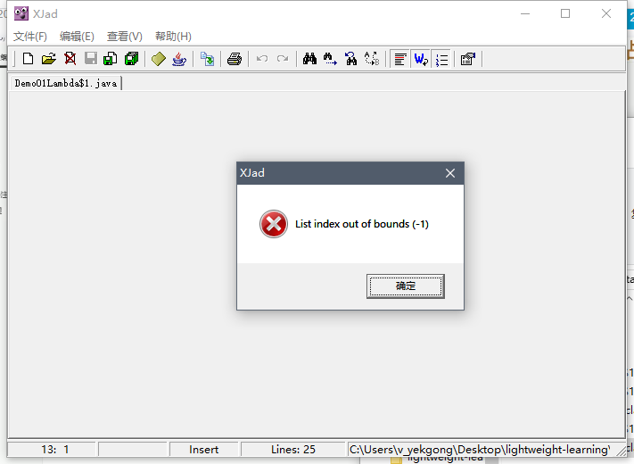

# 一、Lambda 表达式

## 1.1、需求分析 

​	创建一个新的线程，指定线程要执行的任务。

```java
public static void main(String[] args) {
        // 开启一个线程
        new Thread(new Runnable() {
            @Override
            public void run() {
                System.out.println("新线程中执行的代码：" + Thread.currentThread().getName());
            }
        }).start();
        System.out.println("主线程中的代码：" + Thread.currentThread().getName());
    }
```

代码分析：

1. Thread 类需要一个 Runnable  接口作为参数，其中抽象方法 run 方法是用来指定线程任务内容的核心。
2. 为了指定 run 方法体，不得不需要 Runnable 的实现类。
3. 为了省去定义一个 Runnable 的实现类，不得不使用匿名内部类。
4. 必须覆盖重写抽象的 run 方法，所有方法名称，方法参数，方法返回值不得不都重写一遍，而且不能出错。
5. 而实际上，我们只在乎方法体中的代码。

## 1.2、Lambda 的使用

​	Lambda 表达式是一个匿名函数，可以理解为一段可以传递的代码。

```java
new Thread(() -> {
            System.out.println("新线程 Lambda 表达式..." + Thread.currentThread().getName());
        }).start();
```

​	Lambda 表达式的优点：简化了匿名内部类的使用，语法更加简单。

​	匿名内部类语法冗余，体验了 Lambda 表达式后，发现 Lambda 表达式是简化匿名内部类的一种方式。

## 1.3、Lambda 的语法规则

​	Lambda 省去了面向对象的条条框框，Lambda 的标准格式由 3 个部分组成：

```java
(参数类型 参数名称) -> {
    代码体
}
```

## 1.4、Lambda 练习

### 1.4.1、练习1

​	练习无参无返回值的 Lambda

​	定义一个接口：

```java
public interface UserService {
    void show();
}
```

​	主方法调用：

```java
public class Demo02Lambda {

    public static void main(String[] args) {
        goShow(new UserService() {
            @Override
            public void show() {
                System.out.println("show 方法执行了");
            }
        });
        System.out.println("---------------------");
        goShow(() -> {
            System.out.println("lambda show 执行了");
        });
        System.out.println("---------------------");
        goShow(() -> System.out.println("lambda show 1 方法执行了"));
    }

    public static void goShow(UserService userService) {
        userService.show();
    }
}
```

​	输出：

```bash
show 方法执行了
---------------------
lambda show 执行了
---------------------
lambda show 1 方法执行了
```

### 1.4.2、练习2

​	练习有参有返回值的 Lambda 表达式

​	创建一个 Person 对象：

```java
@Data
@AllArgsConstructor
@NoArgsConstructor
public class Person {
    private String name;
    private Integer age;
    private Integer height;
}
```

​	然后我们在 List 集合中保存多个 Person 对象，然后对这些对象做 age 排序操作。

```java
 public static void main(String[] args) {
        List<Person> list = new ArrayList<>();
        list.add(new Person("周杰伦", 33, 175));
        list.add(new Person("刘德华", 43, 185));
        list.add(new Person("周星驰", 38, 177));
        list.add(new Person("郭富城", 23, 170));

               Collections.sort(list, new Comparator<Person>() {
            @Override
            public int compare(Person o1, Person o2) {
                return o1.getAge() - o2.getAge();
            }
        });

        for (Person person : list) {
            System.out.println(person);
        }
    }
```

​	我们发现在 sort 方法的第二次参数是一个 Comparator 接口的匿名内部类，且执行的方法有参数和返回值，那么我们可以改写为 Lambda 表达式。

```java
public static void main(String[] args) {
        List<Person> list = new ArrayList<>();
        list.add(new Person("周杰伦", 33, 175));
        list.add(new Person("刘德华", 43, 185));
        list.add(new Person("周星驰", 38, 177));
        list.add(new Person("郭富城", 23, 170));

        Collections.sort(list, (Person o1, Person o2) -> {
            return o1.getAge() - o2.getAge();
        });

        for (Person person : list) {
            System.out.println(person);
        }
    }
```

​	输出：

```bash
Person(name=郭富城, age=23, height=170)
Person(name=周杰伦, age=33, height=175)
Person(name=周星驰, age=38, height=177)
Person(name=刘德华, age=43, height=185)
```

## 1.5、@FunctionalInterface

```
@FunctionalInterface
被该注解修饰的接口只能声明一个抽象方法
```

## 1.6、Lambda 表达式的原理

​	匿名内部类的本质是在编译时生成一个 Class 文件，XXXX$1.class

```java
public class Demo01Lambda {
    public static void main(String[] args) {
        // 开启一个线程
        new Thread(new Runnable() {
            @Override
            public void run() {
                System.out.println("新线程中执行的代码：" + Thread.currentThread().getName());
            }
        }).start();
        System.out.println("主线程中的代码：" + Thread.currentThread().getName());

        System.out.println("-------------------------------------------------------");

        new Thread(() -> {
            System.out.println("新线程 Lambda 表达式..." + Thread.currentThread().getName());
        }).start();
    }
}
```


​	还可以通过反编译工具来查看生成的代码：Xjad 工具。

```java
static class Demo01Lambda$1
	implements Runnable
{

	public void run()
	{
		System.out.println((new StringBuilder()).append("新线程中执行的代码：").append(Thread.currentThread().getName()).toString());
	}

	Demo01Lambda$1()
	{
	}
}
```

​	那么 Lambda 表达式的原理是什么呢



写有 Lambda 表达式的 class 文件，通过 Xjad 查看报错，这是可以通过 JDK 自带的工具：javap 对字节码进行反汇编操作。

```shell
javap -c -p 文件名.class
-c：表示对代码进行反汇编
-p：显示所有的类和成员
```

​	反汇编的结果：

```java
Compiled from "Demo02Lambda.java"
public class com.moriaty.jdk.lambda.Demo02Lambda {
  public com.moriaty.jdk.lambda.Demo02Lambda();
    Code:
       0: aload_0
       1: invokespecial #1                  // Method java/lang/Object."<init>":()V
       4: return

  public static void main(java.lang.String[]);
    Code:
       0: invokedynamic #2,  0              // InvokeDynamic #0:show:()Lcom/moriaty/jdk/lambda/service/UserService;
       5: invokestatic  #3                  // Method goShow:(Lcom/moriaty/jdk/lambda/service/UserService;)V
       8: return

  public static void goShow(com.moriaty.jdk.lambda.service.UserService);
    Code:
       0: aload_0
       1: invokeinterface #4,  1            // InterfaceMethod com/moriaty/jdk/lambda/service/UserService.show:()V
       6: return

  private static void lambda$main$0();
    Code:
       0: getstatic     #5                  // Field java/lang/System.out:Ljava/io/PrintStream;
       3: ldc           #6                  // String lambda show ִ▒▒▒▒
       5: invokevirtual #7                  // Method java/io/PrintStream.println:(Ljava/lang/String;)V
       8: return
}

```

​	在这个反编译的源码中，我们看到了一个静态方法 lambda\$main$0()，我们可以通过 debug 查看他做了什么


上面的项目可以理解为如下：

```java
public class Demo02Lambda{
    public static void main(String[] args){
        ...
    }
    
    private static void lambda$main$0(){
        System.out.println("lambda show 执行了");
    }
}
```

​	为了更加直观的理解，我们可以在运行的时候添加 `-Djdk.internal.lambda.dumpProxyClasses`，加上这个参数会将内部 class 码输出到一个文件中。

```shell
-Djdk.internal.lambda.dumpProxyClasses
```

​	命令执行：

```shell
java -Djdk.internal.lambda.dumpProxyClasses com.moriaty.jdk.lambda.Demo02Lambda
lambda show 执行了
```

​	生成文件：


​	反编译后：


​	我们可以看到匿名的内部类实现了 UserService 接口，并重写了 show() 方法，在 show 方法中调用了 Demo02Lambda.lambda\$main$0，也就是调用了 Lambda 中的内容。

​	等价于：

```java
public class Demo02Lambda {

    public static void main(String[] args) {
        goShow(new UserService() {
            @Override
            public void show() {
                Demo02Lambda.lambda$main$0();
            }
        });
    }

    private static void lambda$main$0() {
        System.out.println("lambda show 执行了");
    }
}

```

小结：

匿名内部类在编译的时候会产生一个 class 文件。

Lambda 表达式在程序运行的时候会形成一个类。

1. 在类中新增了一个方法，这个方法的方法体就是 Lambda 表达式中的代码。
2. 还会形成一个匿名内部类，实现接口，重写抽象方法。
3. 在接口中重写方法会调用新生成的方法。

## 1.7、Lambda 的省略写法

​	在 Lambda 表达式的标准写法的基础上，可以使用省略写法的规则为：

1. 小括号内的参数类型可以省略
2. 如果小括号内有且仅有一个参数，则小括号可以省略
3. 如果大括号内有且仅有一个语句，可以同时省略大括号，return 关键字及语句分号。

```java
public class Demo04Lambda {

    public static void main(String[] args) {
        goStudent((String name, Integer age) -> {
            return name + age + " 666666";
        });

        // 省略写法
        goStudent((name, age) -> name + age + " 666666");

        goOrder((String name) -> {
            System.out.println(name);
            return 22;
        });

        // 省略写法
        goOrder(name -> 222);
    }

    public static void goStudent(StudentService studentService) {
        studentService.show("张三", 22);
    }

    public static void goOrder(OrderService orderService) {
        orderService.show("李四");
    }
}
```

## 1.8、Lambda 的使用前提

​	Lambda 表达式的语法是非常简洁的，但是 Lambda 表达式不是随便使用的，使用时有几个条件要特别注意。

1. 方法的参数或局部变量类型必须为接口，才能使用
2. 接口中有且仅有一个抽象方法 @FunctionalInterface

## 1.9、Lambda 和匿名内部类的区别

​	Lambda 和匿名内部类的对比：

1. 所需的类型不一样
   1. 匿名内部类的类型可以是类，抽象类，接口
   2. Lambda 表达式需要的类型必须是接口
2. 抽象方法的数量不一样
   1. 匿名内部类所需的接口中的抽象方法所需的数量是随意的
   2. Lambda 表达式所需的接口中只能有一个抽象方法
3. **实现原理不一样**
   1. **匿名内部类是在编译后形成一个 class**
   2. **Lambda 表达式是在程序运行的时候动态生成 class**

