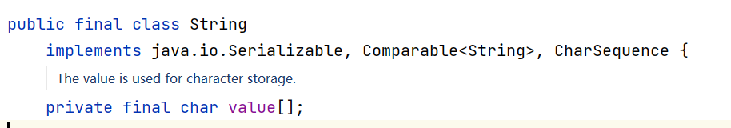
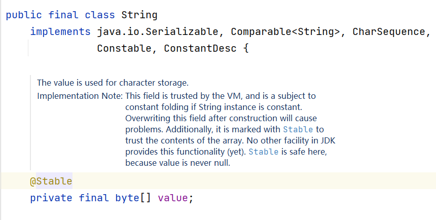

# 一、模块化系统

## 1.1、模块化出现的背景与概念

1. **JAVA 运行环境代码臃肿、效率低：**Java9 之前，每个 runtime 自带开箱即用的所有编译好的平台类，这些类被一起打包到一个 JRE 文件叫做 rt.jar。
2. **无法隐藏内部 API 和类型：**很难真正的对代码进行封装，系统对于不同部分的代码无法分离。

## 1.2、操作

​	在 `src` 目录下新建 `module-info.java`，`exports` 或 `requires` 想要的包。

## 1.3、小结

1. 模块化的好处
   1. 提高效率
   2. 可以实现包隐藏，从而实现包里面所有类的隐藏
2. 如何建立模块与模块之间的联系
   1. 定义一个输出模块信息
   2. 定义一个输入模块信息
   3. 添加依赖


# 二、交互式编程：jshell 工具

## 2.1、交互式编程的概念

​	JDK9 引入了交互式编程，通过 jshell工具实现。交互式编程就是我们不需要编写类，直接声明变量，方法，执行语句，不需要编译即可马上看到效果。

## 2.2、jshell 工具的使用

1. 直接声明变量方法

   int a = 10;

   public void sum(int a, int b){System.out.println("sum;"+a + b);}

2. /list 查看当前所有代码

3. /methods 查看所有方法

4. /var 查看所有变量

5. /edit 打开编辑器

6. /open 执行外部代码

7. /imports 查看默认导入的包


# 三、多版本兼容 jar 包

## 3.1、说明

​	当一个新版本 java 出现，需要花数年时间才能切换到新的版本。这意味这个库需要向后兼容你想要支持的最老的 java 版本。这实际上意味着，很长一段时间，你不能在库中使用 java9 提供的新特性。多版本兼容 jar 功能能让你创建仅在特定版本的 java 环境中运行库程序选择使用的 class 版本。

```java
jar root
    - A.class
    - B.class
    - C.class
    - D.class
	- META-INF
        - versions
        	- 9
        		- A.class
                - B.class
            - 10
                - A.class
```

# 四、接口方法私有化

## 4.1、接口方法私有化的作用

​	当我们在一个接口里写多个默认方法或者静态方法的时候，可能会遇到重复的问题。我们可以把这些重复的程序提取出来，创建一个新的方法，用 `private` 进行修饰，可能会遇到程序重复的问题。我们可以把这些重复的程序提取出来，创建一个新方法，用 `private` 修饰，这样就创建了一个只有接口可以调用的私有方法。

​	**解决接口中默认方法和静态方法的重复问题。**


## 4.2、使用

```java
public interface UserDao {
    /**
     * common
     * 私有方法只允许接口调用，其他类和实现类都不能调用
     */
    private void common() {
        System.out.println("common");
    }

    /**
     * show
     */
    default void show() {
        common();
    }
}
```

```java
public interface UserDao {
    /**
     * common
     * 私有方法只允许接口调用，其他类和实现类都不能调用
     */
    private void common() {
        System.out.println("common");
    }

    /**
     * show
     */
    default void show() {
        common();
    }
}
```

## 4.3、小结

- 目的
  - 解决静态方法或者默认方法代码重复问题

- 使用方法
  - 在方法使用 `private`修饰


# 五、释放资源代码优化

## 5.1、JAVA8 之前释放资源

```java
public class Jdk7 {
    public static void main(String[] args) {
        FileInputStream fileInputStream = null;
        try {
            // 1. 建立程序与文件的数据通道
            fileInputStream = new FileInputStream("C:\\Users\\v_yekgong\\Desktop\\1.txt");

            // 2. 创建字节数组缓冲区
            byte[] buf = new byte[1024];
            int length = 0;

            // 3. 读取数据并且输出
            while ((length = fileInputStream.read(buf)) != -1) {
                System.out.println(new String(buf, 0, length));
            }
        } catch (IOException e) {
            e.printStackTrace();
        } finally {
            // 4. 关闭资源
            if (fileInputStream != null) {
                try {
                    fileInputStream.close();
                } catch (IOException e) {
                    e.printStackTrace();
                }
            }
        }
    }
}
```

​	关闭资源非常累赘，甚至会超过业务代码。

## 5.2、JAVA8 释放资源

```java
public class Jdk8 {
    public static void main(String[] args) {
        // 需要释放资源的代码，放入 try 中：try-with-resource
        // 初始化流对象的代码一定要写到 try 里
        try (FileInputStream fileInputStream = new FileInputStream("C:\\Users\\v_yekgong\\Desktop\\1.txt");) {
            // 1. 建立程序与文件的数据通道

            // 2. 创建字节数组缓冲区
            byte[] buf = new byte[1024];
            int length = 0;

            // 3. 读取数据并且输出
            while ((length = fileInputStream.read(buf)) != -1) {
                System.out.println(new String(buf, 0, length));
            }
        } catch (IOException e) {
            e.printStackTrace();
        }
    }
}
```

​	try-with-resource 要求初始化代码必须放在`try`里。

## 5.3、JAVA9 释放资源

```java
public class Jdk9 {
    public static void main(String[] args) throws FileNotFoundException {
        FileInputStream fileInputStream = new FileInputStream("C:\\Users\\v_yekgong\\Desktop\\1.txt");
        try (fileInputStream) {
            // 1. 建立程序与文件的数据通道

            // 2. 创建字节数组缓冲区
            byte[] buf = new byte[1024];
            int length = 0;

            // 3. 读取数据并且输出
            while ((length = fileInputStream.read(buf)) != -1) {
                System.out.println(new String(buf, 0, length));
            }
        } catch (IOException e) {
            e.printStackTrace();
        }
    }
}
```

## 5.4、小结

- 格式
  - try(流对象引用)


# 六、标识符优化

​	在 JAVA8 和 JAVA8 之前，`_`可以作为标识符使用，但是在 jdk9，`_`已经不能作为单独的标识符出现了。

​	JAVA8：`String _ = "123";`


# 七、String 底层结构的变化

​	在 JAVA9 之前，`String`类的当前实现将字符存储在 `char` 数组中，每个字符使用两个字节（16 位）。从数据中显示，大部分的字符串都 `Latin-1` 编码。这样的字符只需要一个字节的存储空间，**这意味着有一半的空间被闲置。**

​	所以`String`的底层结构从字符数组改为字节数组，目的是为了节省内存空间。

​	JAVA8：



​	JAVA9：



​	**==由于`String`底层结构变化，`StringBuffer`和`StringBuilder`底层也发生了相应的变化。==**


# 八、集合工厂方法：快速创建只读集合

## 8.1、新增的方法

​	调用集合类中的静态方法 `of()`，可以将不同数量的参数传输到此工厂方法中。此功能可用于`Set`和`List`，也可用于`Map`的类似形式。**此时得到的集合，是不可变的。**

- `List.of`
- `Set.of`
- `Map.of`

## 8.2、方法使用

```java
public class CollectionDemo {
    public static void main(String[] args) {
        List<String> list = List.of("张三", "李四", "王五");
        System.out.println(list);
        Set<String> set = Set.of("张三", "李四", "王五");
        System.out.println(set);
        Map<Integer, String> map = Map.of(1, "张三", 2, "李四", 3, "张三");
        System.out.println(map);
        
        // 修改只读集合的内容，会报错 UnsupportedOperationException
        list.add("aa");
    }
}
```


# 九、Stream 流新增的方法

## 9.1、新增方法列表

- `takeWhile()`：从 Stream 中依次获取满足条件的元素，直到不满足条件为止结束获取。**==只要遇到第一个不满足条件的元素马上停止获取。==**
- `dropWhile()`：从 Stream 依次删除满足条件的元素，直到不满足条件为止结束删除。
- `ofNullable`：JAVA8 中 Stream 不能完全为 null（一个元素不能为 null，多个元素可以存在 null），否则会报空指针异常。而 JAVA9 中的 `ofNullable` 方法允许我们创建一个单元素 Stream，可以包含一个非空元素，也可以创建一个空 Stream。

## 9.2、方法使用

```java
public class StreamDemo {

    public static void main(String[] args) {
        testTakeWhile();
        System.out.println();
        testDropWhile();
        System.out.println();
        testOfNullable();
    }

    public static void testTakeWhile() {
        // 从 Stream 中依次获取满足条件的元素，直到不满足条件为止结束获取。只要遇到第一个不满足条件的元素马上停止获取。
        Stream<Integer> stream = Stream.of(10, 20, 30, 40, 50, 7, 60);
        stream.takeWhile(num -> num < 50)
                .forEach(num -> System.out.print(num + ","));
    }

    public static void testDropWhile() {
        // 从 Stream 依次删除满足条件的元素，直到不满足条件为止结束删除。
        Stream<Integer> stream = Stream.of(10, 20, 30, 40, 50, 7, 60);
        stream.dropWhile(num -> num < 50)
                .forEach(num -> System.out.print(num + ","));
    }

    public static void testOfNullable() {
        /*
        JAVA8 中 Stream 不能完全为 null（一个元素不能为 null，多个元素可以存在 null），
        否则会报空指针异常。而 JAVA9 中的 `ofNullable` 方法允许我们创建一个单元素 Stream，
        可以包含一个非空元素，也可以创建一个空 Stream。
         */
        System.out.println(Stream.ofNullable(null).count());
    }
}
```


# 十、多分辨率图片支持

​	在 `java.awt.image`包新增了多分辨率图片支持的 API，用于多分辨率图片的支持。


# 十一、全新的 HTTPClient

## 11.1、概述

​	HTTPClient 的作用就是用于获取网络资源。JAVA9 中有新的方式来处理 HTTP 调用。它提供了一个新的 HTTP 客户端，它将替代仅适用于 blocking 模式的 HttpURLConnection（HttpURLConnection 是在 HTTP 1.0 时代创建的，并使用了协议无关的方法），并提供对 WebSocket 和 HTTP/2 的支持。

​	全新的 HTTP 客户端 API 可以从`jdk.incubator.httpclient`模块中获取。因为在默认情况下，这个模块是不能根据 classpath 获取的，需要使用 add modules 命令选项配置这个模块，将这个模块添加到 classpath 中。

## 11.2、使用

```java
public class HttpClientDemo {
    public static void main(String[] args) throws URISyntaxException {

        HttpClient httpClient = HttpClient.newHttpClient();
        HttpRequest.Builder builder = HttpRequest.newBuilder(new URI("https://utest.21kunpeng.com"));
        HttpRequest request = builder.header("user-agent", "moriaty").GET().build();
        HttpResponse<String> response = httpClient.send(request, HttpResponse.BodyHandler.asString());
        System.out.println(response.statusCode());
        System.out.println(response.body());

    }
}
```


# 十二、被废弃的 API

​	JAVA9 废弃或移除了几个不常用的功能。其中最主要的是 Applet API。Java Applet 就是用 JAVA 语言编写小应用程序，可以直接嵌入到网页中，大部分浏览器已经取消了支持。


# 十三、JavaDoc 的 HTML5 支持

​	JAVA8 的 JavaDoc 支持的是 HTML4 标准。

​	JAVA9 的 JavaDoc 支持 HTML5 标准。


# 十四、JAVA 动态编译器

​	动态编译器出现的目的就是为了提高编译的效率。sjavac 最早在 openjdk8 中提供了初级版本，其初衷是用来加速 jdk 的编译，在 JAVA9 中进行了优化，使其稳定可靠。sjavac 在 javac 的基础上实现了：

- 增量编译：只重新编译必要的内容
- 并行编译：在编译期间使用多个核心


# 十五、钻石操作符的升级

​	JAVA9 开始允许匿名内部类使用与 <> 一起去使用。

```java
public class DiamondDemo {
    public static void main(String[] args) {
        List<String> list = new ArrayList<>(){};
        list.add("aa");
        list.add("bb");
        System.out.println(list);
    }
}
```

